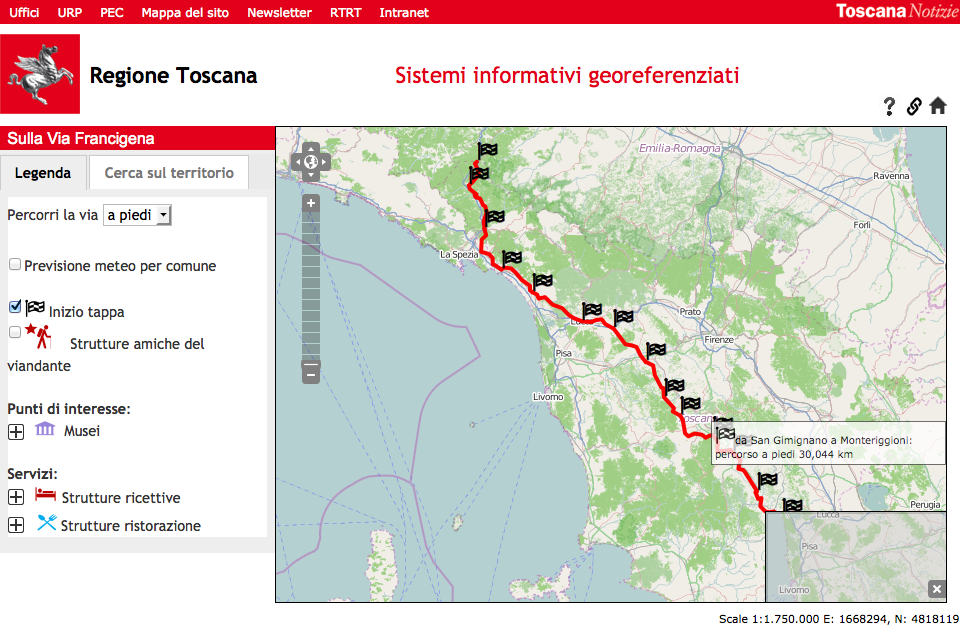
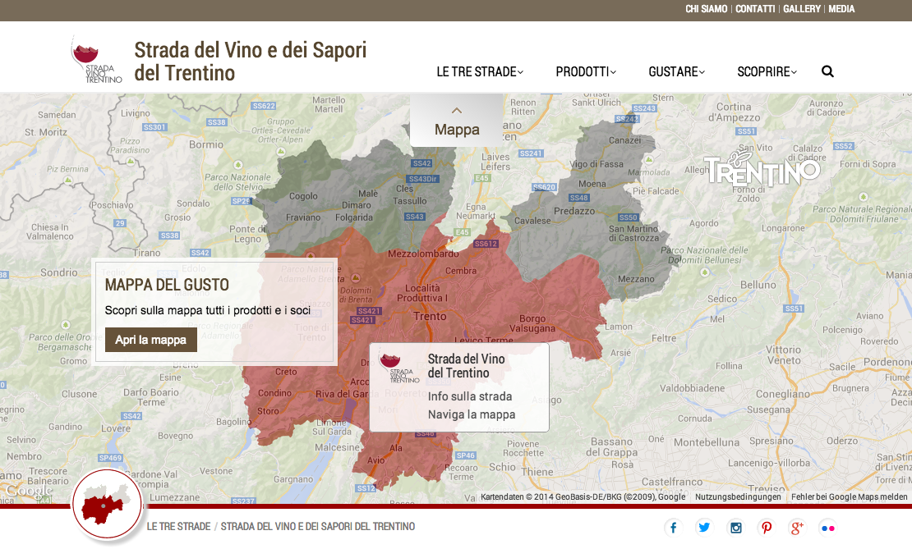
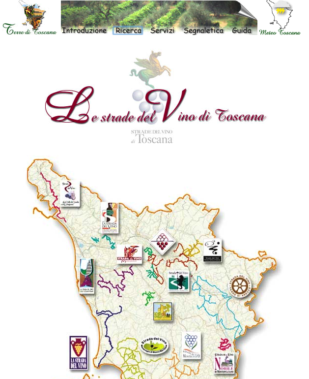

# Use cases and data specified, data modeled and prepared

Deliverable 1.1

## Document History

| Ver. | Name            | Date        | Remark                              |
|------|-----------------|-------------|-------------------------------------|
| v0.1 | Adrian Gschwend | 24.11.2014  | Created initial structure           |
| v0.2 | Adrian Gschwend | 25.11.2014  | Added first chapter                 |
| v0.3 | Adrian Gschwend | 01.12.2014  | First spellcheck, more content      |
| v0.4 | Adrian Gschwend | 02.12.2014  | Ongoing work on user stories        |
| v0.5 | Adrian Gschwend | 03.12.2014  | Added schema chapter                |
| v0.6 | Adrian Gschwend | 04.12.2014  | More work on schema chapter         |
| v0.7 | Adrian Gschwend | 15.12.2014  | Added Roadmap                       |
| v0.8 | Adrian Gschwend | 16.12.2014  | License section, PaaS               |

## Documentation Information

* *Deliverable Nr Title*: D1.1 Use cases and data specified, data modeled and prepared
* *Lead*: Adrian Gschwend (BUAS)
* *Authors*: Adrian Gschwend (BUAS)
* *Publication Level*: Public

### Document Context Information

* *Project (Title/Number)*: Fusepool P3 (609696)
* *Work Package / Task*: WP1 / T1.1, T1,2, T1,3, T1.4
* *Responsible person and project partner*: Adrian Gschwend (BUAS)

### Quality Assurance / Review

* 1st: Marco Combetto
* 2nd: Davide Bruno

### Official Citation

Fusepool-P3-D1.1

### Copyright

This document contains material, which is the copyright of certain
Fusepool P3 consortium parties.

This work is licensed under the Creative Commons Attribution 4.0 International License. To view a copy of this license, visit http://creativecommons.org/licenses/by/4.0/.

## Executive Summary

The goal of Fusepool P3 project is to make publishing and processing of public data as linked data easy. For this purpose Fusepool P3 develops a set of software components that integrate seamlessly by well defined APIs basing on Linked Data Best Practices and the Linked Data Platform standard.

TODO Ignore this for the moment, needs to be completely re-written.

The Fusepool P3 process is divided in the following four steps: exploration, extraction, enrichment and delivery. The software provides tools for the last 3 steps:

 * Extraction: Data from various sources and formats is transformed to RDF and thus made usable in the Linked Open Data (LOD) Cloud.
 * Enrichment: Entity recognition, Natural Language Processing (NLP), Interlinking as well as human processing such as by Crowdsourcing allow to enrich the available data increasing its value to its and to application builders.
 * Delivery: The actual delivery of the data can be separated into making it available via Linked Data standards and the actual presentation to the user with apps running on desktops and mobile devices.

This document describes the TODO.

## Acronyms and Abbreviations

| Acronym |                 Description                  |
|---------|----------------------------------------------|
| ACL     | Access Control List                          |
| API     | Application Programming Interface            |
| BUAS    | Bern University of Applied Sciences          |
| CKAN    | Comprehensive Knowledge Archive Network      |
| CSV     | Comma-separated Values                       |
| ETL     | Extract, Transform, Load                     |
| FP3     | Fusepool P3                                  |
| GIS     | Geographic information system                |
| GTFS    | General Transit Feed Specification           |
| HTTP    | Hypertext Transfer Protocol                  |
| HTTPS   | Secure Hypertext Transfer Protocol           |
| IRI     | Internationalized Resource Identifier        |
| UI      | User Interface                               |
| JSON    | JavaScript Object Notation                   |
| JSON-LD | JSON for Linking Data                        |   
| KML     | Keyhole Markup Language                      |
| LDP     | Linked Data Platform                         |
| LDP-BC  | Linked Data Platform Basic Container         |
| LDPC    | Linked Data Platform Container               |
| LDP-DC  | Linked Data Platform Direct Container        |
| LDP-IC  | Linked Data Platform Indirect Container      |
| LDP-NR  | Linked Data Platform Non-RDF Source          |
| LDPR    | Linked Data Platform Resource                |
| LDP-RS  | Linked Data Platform RDF Source              |
| PaaS    | Platform as a Service                        |
| PAT     | Provincia Autonoma di Trento                 |
| POI     | Point of interest                            |
| RDF     | Resource Description Framework               |
| RDFa    | RDF in Attributes                            |
| RDFS    | RDF Schema                                   |
| REST    | Representational State Transfer              |
| RET     | Regione Toscana                              |
| SEO     | Search engine optimization                   |
| SPARQL  | SPARQL Protocol and RDF Query Language       |
| SQL     | Structured Query Language                    |
| URI     | Uniform Resource Identifier                  |
| URL     | Uniform Resource Locator                     |
| W3C     | World Wide Web Consortium                    |
| WG      | Working Group                                |
| WP      | Work Package                                 |
| XML     | Extensible Markup Language                   |

## Normative namespaces

In this document the prefixes used in [CURIEs](http://www.w3.org/TR/curie/) shall refer the following
IRI prefixed:

| Prefix | Namespace|
|--------|----------|
| dcat  | [http://www.w3.org/ns/dcat#](http://www.w3.org/ns/dcat#) |
| dct    | [http://purl.org/dc/terms/](http://purl.org/dc/terms/) |
| eldp   | [http://vocab.fusepool.info/eldp\#](http://vocab.fusepool.info/eldp#) |
| fam    | [http://vocab.fusepool.info/fam\#](http://vocab.fusepool.info/fam#) |
| fp3    | [http://vocab.fusepool.info/fp3\#](http://vocab.fusepool.info/fp3#) 
| geo    | [http://www.w3.org/2003/01/geo/wgs84_pos#](http://www.w3.org/2003/01/geo/wgs84_pos#) |
| gtfs  | [http://vocab.gtfs.org/terms#](http://vocab.gtfs.org/terms#) |
| ldp    | [http://www.w3.org/ns/ldp\#](http://www.w3.org/ns/ldp#) |
| oa     | [http://www.w3.org/ns/oa\#](http://www.w3.org/ns/oa#) |
| prov  | [http://www.w3.org/ns/prov#](http://www.w3.org/ns/prov#) |
| rdf    | [http://www.w3.org/1999/02/22-rdf-syntax-ns\#](http://www.w3.org/1999/02/22-rdf-syntax-ns) |
| rdfs   | [http://www.w3.org/2000/01/rdf-schema\#](http://www.w3.org/2000/01/rdf-schema) |
| schema    | [http://schema.org/](http://schema.org/) |
| trans  | [http://vocab.fusepool.info/transformer\#](http://vocab.fusepool.info/transformer#) |
| void  | [http://rdfs.org/ns/void#](http://rdfs.org/ns/void#) |
| weather | [TODO](http://TODO)
| xsd    | [http://www.w3.org/2001/XMLSchema\#](http://www.w3.org/2001/XMLSchema)  |

## Introduction

This document describes the TODO

The main goal of the Fusepool P3 architecture is to provide interaction protocols and pattern so that the components can be used in concert to form the Fusepool P3 Platform.

### Use case summary

TODO rewrite summary

The Fusepool P3 project partners Provincia Autonoma di Trento and Regione Toscana have been publishing Open Data and develop apps in the domain of tourism for several years. During this time both partners gained valuable experience in data creation, maintenance and publication. 

Many of the published Open Data sets are used in Android or iOS apps aimed at tourists and/or inhabitants of the region. Some of them are written by the project partners, other apps by 3rd party developers which integrate parts of the published Open Data into their own apps.

As of today the data is mainly available in particular data formats like CSV, KML, XML and JSON. App developers need to download the raw data and process it using their own ETL (Extract, Transform, Load) processes. With every update of the raw data this process has to be triggered for every single application where it is used. If the format of the raw data changed, the process has to be adjusted and cannot be automated. With every new data source, maintenance complexity of these Open Data sets and its apps increases.

Linked Data can help to solve these problems: Data is made available in a standard format (RDF) which provides among others the following benefits[[1]](#ftnt1):

-   Every piece of information (data) has its own identifier (URI/IRI).
-   Those identifiers can be resolved via the web (HTTP),
-   which acts as a generalized API for developers.
-   Standardized vocabularies describe the meaning of the data,
-   and allow to relate information with each other.

The Linked Data technology stack [Bizer2009] provides many ways to interact with data in RDF format [Cyganiak2014]. This greatly reduces the overhead needed to integrate data sets into apps and thus increases the value of Open Data. However, one needs new ETL processes to transform raw data to Linked Data. While it facilitates data usage for app developers, Linked Data requires initially more work by the data owner and publisher.

In the past years many powerful tools got developed or extended to support creation and maintenance of Linked Data. Also new W3C standards and vocabularies are developed for turning legacy data into Linked Data. Many of these tools and standards are developed, extended or implemented by Fusepool P3 project partners. The emerging Linked Data Platform Standard (LDP)[[7]](#ftnt7) provide standardized means for making collections of linked data resources accessible.

What is lacking is an integration framework that combines the data transformation to RDF, possible enhancement steps and the publishing of the Linked Data. Fusepool P3 will provide such an integration framework along with User Interface tools that serve both to model the data publication process as well as to coordinate the human interactions that might be required while the data is processed.

This framework will integrate state-of-the-art tools like OpenRefine, OpenLink Virtuoso, Apache Stanbol, and Pundit. The framework is developed and tested based on the requirements by our project partners Provincia Autonoma di Trento (PAT) and Regione Toscana (RET). Both partners have started working with the platform in an early stage and feedback gets directly integrated into the agile development process of Fusepool P3.

## User Requirements and Data Identification

>T1.1 - User requirements: identify key stakeholders, conduct in-depth interviews in the tourism related field; map requirements and expectations to functionality and develop use scenarios based on these requirements to form the basis of conceptual and functional test models.

>T1.2 - Identify the data. Select potentially value-adding data sources based on application scenarios and use cases that a) provide a concrete benefit for the public agencies and SMEs, b) are likely to be re-used by others and c) integrate well into the existing Linked Data cloud.

TODO

* Mention other potential stakeholders
* expectation mapping, check notes from interviews with PAT & RET
* Rough description of the Fusepool platform, maybe add mocks where they fit
* Maybe some more pointers on other data sets for T1.2, related to the schemas in the next chapter

----

To assure that Fusepool P3 creates a real value for the involved project partners and new stakeholders, it is essential to understand their motivation and needs. The Fusepool P3 project partners Provincia Autonoma di Trento (PAT) and Regione Toscana (RET) have been publishing Open Data and developing apps in the domain of tourism for several years. During this time both partners gained valuable experience in data creation, maintenance and publication.

To answer the questions risen in T1.1 we had to enter into a dialogue with PAT and RET to understand what, why and how they publish open data about their provinces. The provinces are represented by three different persons working for them: M. Combetto for PAT and W. Volpi and D. Bruno for RET. All of them are at the end of the publishing chain and responsible for publishing data sets from other divisions and groups as open data. Changes in the data sets can be requested but our partners have limited influence on if and how fast this will happen. All of them work with IT and have a profound technical understanding of what is needed to publish open data. While they do see the potential, they do not have a lot of hands-on experience with Linked Data yet; this is one of the motivations for them to be partner in Fusepool P3.

As of today both partners publish there data into a public CKAN[^ckan] repository[^ckanret][^ckanpat]. CKAN is a data management system aimed at data publishers wanting to make their data open and available. It provides tools to facilitate this publishing step and helps finding and using data. The data quality completely depends on the data provider. There is no additional work done on the data sets except adding some meta information. The data which gets pushed into the system is the data which is made available to the user.

Currently available open data by PAT and RET is available in particular data formats like CSV, KML, XML and JSON. App developers need to download the raw data and process it using their own ETL (Extract, Transform, Load) processes. With every update of the raw data this process has to be triggered for every single application where it is used. If the format of the raw data changed, the process has to be adjusted and cannot be automated. With every new data source, maintenance complexity of these Open Data sets and its apps increases.

In interviews with PAT and RET it became clear, that this is one of the big obstacles of the current approach. There is far more knowledge in these data sets available than what is visible and accessible to the open data developer.
This is best explained by the example of Via Francigena[^viafrancigena], an ancient road and pilgrim route running from France to Rome. In their geographic information system (GIS) RET collects many point of interest (POI) around this ancient road[^fragis]. This dataset is made available to the public but the data alone does not tell the full story of the POI. 

The term point of interest is very generic: It can be something obviously useful in this context like a restaurant or a hotel along the road. A bit less obvious but still useful are other examples like pharmacies where one can treat its blisters from walking or public wireless access to upload the latest pictures to Facebook and Instagram. But a point of interest can also be a snippet of plain text which puts the POI into a historical context. Using this kind of information in a generic, re-usable way is technically much more difficult than the obvious examples. A plaintext example could be that a famous person ate this specific dish back in the days and it became a signature dish since then. As a tourist I might want to know which restaurant along the way provides this dish and where I can buy the particular ingredient for taking it home.

TODO tourism that enhances the cultural, environmental and historical heritage of the historic path, creating opportunities for small enterprises and for a conscious development of the territory. 

As mentioned before data is available in many different formats. In best case for the app developer the data format is standardized and well supported in ETL tools. Unfortunately this is rarely the case as every data user has his own, mostly proprietary data management tool or application for maintaining it. This can be well seen in the available datasets from the two provinces PAT and RET. There are a few standardized and semantically meaningful data sets in formats like KML[^kml] or Shapefile[^shapefile], which are used for expressing geographic annotation and visualization. In between that there are semantically still quite valuable XML formats. One example is weather data[^weather] about the province, although in a non-standard schema and using italian identifiers for the XML elements. The vast majority of the data is available in semantically poor data formats like CSV or JSON.

TODO insert stats here

The terms "semantically meaningful" and "semantically poor" are indicators of how much work is needed to do something useful within for example a mobile application. Reading, or in app developer terms parsing data in a certain format is just the first and often the easier step. Once the data is in a structure the app developer can handle, she needs to figure out what the data is about, or in other words understand its semantics. This is where the real work starts and this is harder in semantically poor data formats like CSV and JSON, as the indication about what the field value really means is completely up to the one providing the data and if available, often hard to understand for others.

This is one of the main remarks when talking with PAT and RET: While a lot of data is available it lacks even the most basic form of relationship between the different data sets. They explained it on the example of Tripadvisor: While they have an impressive dataset for certain kind of data, it is not possible to relate it properly with for example Via Francigena. These are the kind of challenges they would like to see solved with Linked Data and that is where they need support by a tool. 

### The case for Linked Data

Linked Data addresses some of the mentioned problems users see with Open data. It does that by providing a standardized format (RDF) which provides among others the following benefits:

- Every piece of information (data) has its own identifier (URI/IRI).
- Those identifiers can be resolved via the web (HTTP),
- which acts as a generalized API for developers.
- Standardized vocabularies describe the meaning of the data,
- and allow to relate information with each other.
- SPARQL is its standardized querying language.
- Built-in support for multiple languages by using language-tagged string literals.

Another example from PAT and RET shows how this can be useful for app developers and in the end for tourists visiting the regions. To promote local wines both regions provide a website called *Strada del Vino* where one can find information about specific wines its wineyards. The two websites[^winepat][^wineret] are completely independent of each other and look pretty much different. Also most of the content is only available in Italian language excluding visitors from other countries which minimal or no Italian skills. 

From a data perspective, it would probably be quite straight forward to generalize the information that is made available for the tourist. It could consists of:

* Spacial datasets, providing shapes and/or coordinates of
    - wineyards
    - wineregions
    - wine-cellars
* Metadata for those data sets like
    - who provides wine tasting
    - ratings & prices won by wineyards
    - pricing, price-ranges
    - opening hours where appropriate
    - information about shipping to foreign/overseas countries
    - import/tax restrictions for foreign countries
    - information about distributors of this particular wine in foreign countries
* Generic information about wine like
    - Types and explanations of different raisins
    - Characters of wine, related to what is available in the region
    - Some historical context (could be plaintext)
    - Linking a specific wine with certain types of meals
    - Special offers which are available (obviously liked with where where)
    - Information about rare and special wines, for example addressed at wine connoisseur
    - which wines did Julius Caesar drink while building the Roman Empire

*Strada del Vino* in PAT and RET just contain of and show a small subset of this data. Not all information might be available as of now but this is mainly related to the fact that it is just too much work to create a proprietary application for each region. Linked Data can change this as every region would use the same schemas for describing the data and an application developer could easily add new regions which provide the necessary data sets. It would also motivate wineyards to provide more information about themselves to get better visibility in the application and thus generate more revenue.

### Fusepool P3 Development Roadmap

Fusepool P3 aims at bringing the presented use-cases into the reality. To do this we need to make sure that the platform provides the necessary features and usability so that PAT, RET and other stakeholders can use the Fusepool P3 platform in their environment. 

To get there, Fusepool P3 is using an agile development model which is oriented at the Scrum[^scrum] methodology. A rough development roadmap was presented and agreed on at the Salzburg project meetup in May 2014. The roadmap is based on The Go Product Roadmap[^goroadmap] and defines the following milestones.

The roadmap is permanent work in progress and gets updated accordingly. Based on WP1 requirements outlined in this document, the WP1 team fills the Fusepool P3 Jira Backlog[^p3jira] with user stories and defines Scrum sprints with the developers.

#### Bootstrap!

Timeframe: 1.1 - 7.5.2014

Goal: Build the team and get started.

Features:

* Website
* Agreement on technical architecture
* Integration of some partner tools
* Scrum methodology
* Contractual framework and roles established

Metrics:

* Everyone commits on common architectural principles
* The website represents the team, the partners, its diversity and the goals
* Everyone understands and participates to Scrum
* All roles are assigned
* Contractual framework ensures all partners can benefit from website (domains etc) during and after the grant period

#### Spaceport

Timeframe: 8.Mai - 15.July 2014

Goal: First version of platform foundation implemented; Major REST APIs defined and prototype implementations available.

Features:

* Roadmap and backlog (T1.1)
* Some datasources identified and core ontologies determined (part of T1.2-T1.4)
* LDP Implemented
* First GUI
* First extractors

Metrics:

* Jira Backlog is filled with high-level stories
* LDP platform available
* Initial REST APIs defined and implemented

#### Neil Amstrong

Timeframe: 16.July - 5. October 2014            

Goal: User can start using the software for enrichment tasks; external developers can use our clearly defined REST APIs.      

Features:

* Basic REST APIs are defined an prototypically implemented
* First user documentation
* UI POC
* Deployment manual         

Metrics:

* User can setup and start a semantic enrichment process (on command line)
* Developers documentation available so they can implementing their own services
* First HTML5 based UI POCs available

#### ISS

Timeframe: 6.October 2014 - 5. February 2015        

Goal: Our software can be used by many people.    

Features:

* Stable REST APIs & documentation
* Full P3 workflow implemented
* Fusepool P3 platform instance available for PAT and RET

Metrics:

* Required use-case schema/vocabularies are identified
* Project partners provide first examples in using the processing pipeline with PAT and RET datasets
* PAT and RET are able to integrate their own data sets into the pipeline
* Stable implementations of available transformers and enhancers

#### ULCS

Timeframe: 6. February - 5. June 2015        

Goal: The platform can handle large amounts of data.

Features:

* Stable platform that scales

Metrics:

* Large amount of datasets from PAT and RET are published as RDF
* Platform scales appropriately

#### Teleporter

Timeframe: 6. June - 2. October 2015        

Goal: Smooth and elegant data tools.

Features:

* Easy to understand UIs for all necessary steps available
* Schema/vocabulary integration & support for the user
* More transformers/enhancers (where appropriate)

Metrics:

* PAT and RET are using the platform actively
* Additional stakeholders are identified and partially start using the platform
* Public release of the platform, new users attracted

#### Opal

Timeframe: 3. October - 31. December 2015

Goal: Make it shine.

Features:

* Stable platform, easily deployable

Metrics:

* Stable release of the P3 platform
* Fusepool P3 is used outside the P3 consortium

## Data Modeling

>T1.3 - Model the data: Identify existing ontologies/vocabularies to model the data, agree on standard structural and descriptive metadata, and define data models that reuse existing approaches and schemas to model relational and other data sources. 

PAT and RET do not have much experience with RDF. There are a few datasets available in RDF but they use their own, ad-hoc schema and are thus of limited use and not actively maintained. To facilitate the process of creating RDF out of the other sources, they asked to get support in choosing and using the right schemas and ontologies.

Finding the most appropriate vocabulary, schema or ontology can be tricky. There is not necessarily one single right answer, as there are often multiple competing ontologies available. In this chapter we present different ontologies which are an appropriate choice for the data provided by PAT and RET. If there is more than one option available for describing a certain data set, we chose the one with the biggest adoption in the real world.

### schema.org 

In 2011 several search engine giants launched schema.org[^schemaorg], an initiative to "create and support a common set of schemas for structured data markup on web pages". This effort was first criticized by the Semantic Web community but the involved parties started talking with each other and later several people from the Semantic Web community started providing a "proper" RDF mapping[^schemardf]. Meanwhile schema.org seems to use "a simple RDF-like graph data model" and exposes its schema as RDFa[^rdfa]. However, there is no content negotiation[^contentneg] in place and the only language available for description of classes and labels is English.

Looking back three years schema.org had a huge impact, many sites started to include structured information within their websites and the support of first RDFa and later JSON-LD[^jsonld] made people use Semantic Web technologies without being really aware of it. This increases visibility and perception of the Semantic Web as a whole.

Using schema.org within Fusepool P3 as one of the main schemas makes sense for various reasons:

* Its popularity for search engine optimization (SEO) makes it well known. Most web- and application developers probably heard of it already or even use it.
* Due to its SEO origin, schema.org provides a lot of classes and properties in the tourism related field. Examples:
    - [Restaurant](http://schema.org/Restaurant)
    - [Opening hours](http://schema.org/OpeningHoursSpecification)
    - [Museum](http://schema.org/Museum)
    - [Place](http://schema.org/Place)
    - [Pharmacy](http://schema.org/Pharmacy)
    - [telephone](http://schema.org/telephone)
    - [Postal address](http://schema.org/PostalAddress)
* There are mappings available for other popular schemas[^sorgmap1][^sorgmap2].
* While the descriptions are only available in English, they are pretty understandable and well maintained. This is not always the case in the schema world.

One of the wishes from PAT and RET is to provide Italian translations for at least the classes and properties which are useful within the Fusepool P3 use scenarios. This can surely be done within our Fusepool P3 platform and during the second year of Fusepool P3 it might make sense to talk to schema.org maintainers and see if those translations could be made available for others. At the time writing we are not aware of any other effort to provide such translations.

While schema.org defines a lot, it is not sufficient for all data currently available by PAT and RET. Also in some domains other schemas are more popular so it does make sense to use them as well within the Fusepool P3 platform.

### WGS84 Geo Positioning

To represent positions, the most widely used standard in cartography, geodesy, and navigation is World Geodetic System (WGS). Its most recent version is WGS 84[^wgs84]. There is an RDF representation available which is widely used in the Semantic Web world, called "WGS84 Geo Positioning: an RDF vocabulary"[^wgs84rdf]. It provides definitions like:

* SpatialThing
* location
* latitude, longitude (or a combination of both)
* altitude 

There is a competing definition available in schema.org[^schemageo] but within Fusepool P3 we will focus on the W3C namespace.

To be able to query point of interests it is essential that they represent a geo coordinate. If there is no latitude/longitude value available, the data should be enriched within the Fusepool P3 pipeline so it can be queried properly. For querying this data we use GeoSPARQL[^geosparql] or comparable (non-standard) services provided by the triplestore.

### Geographical Shapes

There are several data sets available which provide geographical shapes, for example GML. Transforming data sets like this to RDF is a relatively new field and it generates some interesting questions especially in regard to the way shapes are represented in triples. Fusepool P3 is using existing work to translate such data to RDF, like the XSLT based transformation described[^gml2rdf] in the GML2RDF paper [Brink2014].

The first version of GML was represented in RDF, after that it became a XML format and schema. The work described in this paper appears to be a proof of concept, several namespaces do not seem to support proper content negotiation and/or return a RDF schema.

Virtuoso also supports transforming KML to RDF. TODO.

### Annotators

The Fusepool P3 Annotation Model is used by all Annotator implementations of the Fusepool Platform. Annotators and transformers together build the components of the Transformation API.

An introduction to this model can be found in deliverable D5.1, the final specification of FAM is presented as part of deliverable D3.1. An online documentation of the model can be found in the corresponding Github repository[^famgh].

### Public Transportation Schedules

Information about public transportation schedules and associated geographic information is made available in the General Transit Feed Specification (GTFS)[^gtfsgg]. GTFS "feeds" allow public transit agencies to publish their transit data and developers to write applications that consume that data in an interoperable way.

A GTFS feed is a collection of CSV files in a common format. There are several transformers available which convert GTFS to RDF, one of them is integrated by Virtuoso and used within the Fusepool P3 platform. While there is no official RDF schema from Google some volunteers created an RDF specification that is made available at `vocab.gtfs.org[^gtfs].

### Weather Forecasts

Surprisingly it seems to be particularly hard to find a widely used ontology which is suitable for weather forecasts. We found several examples of weather forecast in RDF but most of them use ad-hoc vocabularies. After asking around in the Semantic Web scene we could identify an OWL ontology by using the LOV[^lov] search functionality.

This ontology was developed by Paul Staroch within his master thesis [Staroch2013]. The thesis, a presentation and the ontology itself is available at his homepage[^staroch]. The ontology makes a very complete impression and is to our knowledge currently the best choice for representing weather data in RDF. In LUV we could find two ontologies, one within the `www.auto.tuwien.ac.at` namespace. From what we can see this seems to be an earlier, incomplete version of the Smart Home Weather ontology and should not be used. The most recent version can be found at `http://paul.staroch.name/thesis/SmartHomeWeather.owl#`.

### Data Provenance

Fusepool P3 is supporting Open Data publishers and users in creating Linked Data. It is important to keep track of the purpose and provenance of the data so both the users and the publishers can keep track of the available data sets.

In the Semantic Web world there are well-established ontologies which support us in this process:

* VoID[^void] is used for expressing metadata about RDF datasets. It is intended as a bridge between the publishers and users of RDF data, with applications ranging from data discovery to cataloging and archiving of datasets.
* Prov[^prov] can be used to represent and interchange provenance information generated in different systems and under different contexts.
* DCAT[^dcat] facilitates interoperability between data catalogs published on the web. Publishers increase discoverability and enable applications easily to consume metadata from multiple catalogs.

Fusepool P3 does not add any of these information by default. It is the responsibility of the user to add specific information to the data describing its use and provenance. Automatically adding specific metadata to the triples was discussed within developers but is currently not supported in the platform. However, it might be added in the future where appropriate and feasible.

## Data Preparation

>T1.4 - Prepare the data: Adopt and implement consistent representations of data resources along with their human and machine readable descriptions, evaluate and specify appropriate data publication licenses as well as appropriate hosting solutions and regular maintenance intervals.

### Data Pipeline

TODO

* Steps done in 01/15 for data integration
* CKAN integration

### Open Data License

Both PAT and RET decided to use liberal Creative Commons[^cc] licenses. Most of the content for PAT and RET is released under a CC-BY[^ccby] license. For RET this was a decision of a permanent working group, which is in charge of facilitating the process to liberate data as open date in the Regione Toscana. Some of the content is also released under CC0[^cc0]. CC0 is basically giving up all rights on the data, from the definition on the Creative Commons homepage:

>The person who associated a work with this deed has dedicated the work to the public domain by waiving all of his or her rights to the work worldwide under copyright law, including all related and neighboring rights, to the extent allowed by law.

>You can copy, modify, distribute and perform the work, even for commercial purposes, all without asking permission.

CC-BY is still a very liberal license and allows to share and/or adapt the data for any purpose, even commercially. However:

>You must give appropriate credit, provide a link to the license, and indicate if changes were made.

PAT is currently investigating about an issue to be compatible with OpenStreetMap[^osm], which is using the ODbL[^odbl] license. This license is comparable with CC-BY, from the OpenStreetMap homepage:

>You are free to copy, distribute, transmit and adapt our data, as long as you credit OpenStreetMap and its contributors. If you alter or build upon our data, you may distribute the result only under the same licence. 

In the human readable definition[^odblhr] it clarifies additional statements about adapting and using the work:

>Attribute: You must attribute any public use of the database, or works produced from the database, in the manner specified in the ODbL. For any use or redistribution of the database, or works produced from it, you must make clear to others the license of the database and keep intact any notices on the original database.

>Share-Alike: If you publicly use any adapted version of this database, or works produced from an adapted database, you must also offer that adapted database under the ODbL.

>Keep open: If you redistribute the database, or an adapted version of it, then you may use technological measures that restrict the work (such as DRM) as long as you also redistribute a version without such measures.

This is a smart move as it clearly encourages using the data for commercial purposes but at the same time requires that changes are released under the same license and restricted versions of the work are also available in a public version. OpenStreetMap was initially using a Creative Commons license but they run into issues they did not think of before and where Creative Commons is not appropriate enough for complete database dumps. These reasons are well outlined in an article at O'Reilly Radar[^osmchange]. As a conclusion, most of the content for PAT and RET can be used under CC-BY or CC0 license, which currently provides one of the best choices for Open Data.

### Fusepool P3 as a Service

In discussions with PAT and RET it became clear that they do not intend to compile and run development versions of the Fusepool P3 platform on their own. To make sure they can test the platform on a regular base and give feedback to the developers, the Fusepool P3 team provides a public version of the platform[^sandbox]. This version is used by the Fusepool P3 team, PAT and RET and in 2015 also by other stakeholders which will be involved with the project.

It is also important to make sure that developers can run their own versions of the platform. But not everyone wants to compile the whole stack on his own; for that reason the Fusepool P3 team decided to use continuous integration[^ci] tools available on the Github platform, which are using Travis CI[^travisci] in the background. New releases of the software are automatically built by Travis CI and made available as binary on Github.

## References

| Ref.             | Description |
|------------------|-------------|
| BernersLee2006 | Berners-Lee, T. (2006). Design issues: Linked Data. W3C. |
| Bizer2009        | Bizer, C., Heath, T., & Berners-Lee,T. (2009). Linked data-the story so far. International journal on semantic web and information systems, 5(3), 1-22.                                                      |
| Brink2014       | Linda van den Brink, Paul Janssen, Wilko Quak, Jantien Stoter. (2014). Linking spatial data: automated conversion of geo-information models and GML data to RDF. International Journal of Spatial Data Infrastructures Research, Vol 9 2014 |
| Perry2010 | Perry, M. and J. Herring (2010). OGC GeoSPARQL - A Geographic Query Language for RDF Data. |
| Staroch2013 | Paul Staroch. (2013). A Weather Ontology for Predictive Control in Smart Homes |

Copyright Fusepool P3 Consortium

* * * * *

[^ckan]: Open Source Software, available at [ckan.org](http://ckan.org/)

[^ckanpat]: CKAN of PAT at [dati.trentino.it](http://dati.trentino.it/)

[^ckanret]: CKAN of RET at [dati.toscana.it](http://dati.toscana.it/
)

[^viafrancigena]: Via Francigena in [Wikipedia](http://en.wikipedia.org/wiki/Via_Francigena)

[^fragis]: Direct access to the [GIS entry](http://www306.regione.toscana.it/mappe/index_francigena.html?area=francigena_multi_cluster) of Via Francigena

[^weather]: http://dati.toscana.it/dataset/previ-meteo-localita

[^kml]: http://en.wikipedia.org/wiki/Keyhole_Markup_Language

[^shapefile]: http://en.wikipedia.org/wiki/Shapefile

[^winepat]: http://www.tastetrentino.it/le-tre-strade/strada-del-vino-e-dei-sapori-del-trentino/home/

[^wineret]: http://www.terreditoscana.regione.toscana.it/stradedelvino/ita/index-ita.html

[^schemaorg]: Homepage at [schema.org](http://schema.org/), source code at [Github](https://github.com/rvguha/schemaorg)

[^schemardf]: Homepage at [schema.rdfs.org](http://schema.rdfs.org/), source code at [Github](https://github.com/mhausenblas/schema-org-rdf)

[^rdfa]: RDF in Attributes, see [RDFa primer](http://www.w3.org/TR/xhtml-rdfa-primer/)

[^contentneg]: A good introduction to content negotiation can be found at [Mozilla Developer Network](https://developer.mozilla.org/en-US/docs/Web/HTTP/Content_negotiation)

[^jsonld]: JSON for Linking Data (JSON-LD) is a JSON based RDF serialization. See [json-ld.org](http://json-ld.org/).

[^sorgmap1]: http://dcmi.github.io/schema.org/mappings.html

[^sorgmap2]: https://github.com/mhausenblas/schema-org-rdf/tree/master/mappings

[^wgs84]: [World Geodetic System WGS 84](http://en.wikipedia.org/wiki/World_Geodetic_System#A_new_World_Geodetic_System:_WGS_84)

[^wgs84rdf]: [WGS84 Geo Positioning: an RDF vocabulary](http://www.w3.org/2003/01/geo/wgs84_pos#)

[^schemageo]: [schema.org GeoCoordinates](http://schema.org/GeoCoordinates)

[^geosparql]: http://www.geosparql.org/

[^gml2rdf]: [From Geo-Data to Linked Data: Automated Transformation from GML to RDF](http://www.pilod.nl/wiki/Boek/BrinkEtAl-GML2RDF)

[^gtfsgg]: Official [GTFS](https://developers.google.com/transit/gtfs/) homepage at Google Developer

[^gtfs]: [Homepage](http://www.gtfs.org/), [RDF schema](http://vocab.gtfs.org/terms#) and [Github repository](https://github.com/OpenTransport/vocabulary/tree/master/gtfs)

[^lov]: [LOV](http://lov.okfn.org/dataset/lov/), your entry point to the growing ecosystem of linked open vocabularies

[^staroch]: Homepage at [paul.staroch.name](https://paul.staroch.name/en/)

[^prov]: [PROV Model Primer](http://www.w3.org/TR/2013/NOTE-prov-primer-20130430/)

[^void]: [Describing Linked Datasets with the VoID Vocabulary](http://www.w3.org/TR/void/)

[^dcat]: [Data Catalog Vocabulary (DCAT)](http://www.w3.org/TR/vocab-dcat/)

[^famgh]: [Fusepool P3 Annotation Model](https://github.com/fusepoolP3/overall-architecture/blob/master/wp3/fp-anno-model/fp-anno-model.md)

[^scrum]: See [The Scrum Guide](https://www.scrum.org/)

[^goroadmap]: Available at the [homepage](http://www.romanpichler.com/tools/product-roadmap/) of Roman Pichler

[^p3jira]: Public [Fusepool P3 Jira](https://fusepool.atlassian.net/secure/RapidBoard.jspa?rapidView=2&useStoredSettings=true)

[^cc]: See [Creative Commons homepage](http://creativecommons.org/) for more information

[^ccby]: [Attribution 4.0 International (CC BY 4.0)
](http://creativecommons.org/licenses/by/4.0/)

[^cc0]: [CC0 1.0 Universal (CC0 1.0)Public Domain Dedication ](https://creativecommons.org/publicdomain/zero/1.0/)

[^osm]: [OpenStreetMap](http://www.openstreetmap.org/)

[^odbl]: See [opendatacommons.org/licenses/odbl/](http://opendatacommons.org/licenses/odbl/)

[^odblhr]: See [homepage](http://opendatacommons.org/licenses/odbl/summary/)

[^osmchange]: See [Why OpenStreetMap is moving from Creative Commons to the Open Database License.](http://radar.oreilly.com/2011/06/openstreetmap-creative-commons-open-database-license.html)

[^sandbox]: Available at [sandbox.fusepool.info](http://sandbox.fusepool.info/)

[^ci]: See [Wikipedia](http://en.wikipedia.org/wiki/Continuous_integration)

[^travisci]: Available at [travis-ci.org](https://travis-ci.org/)