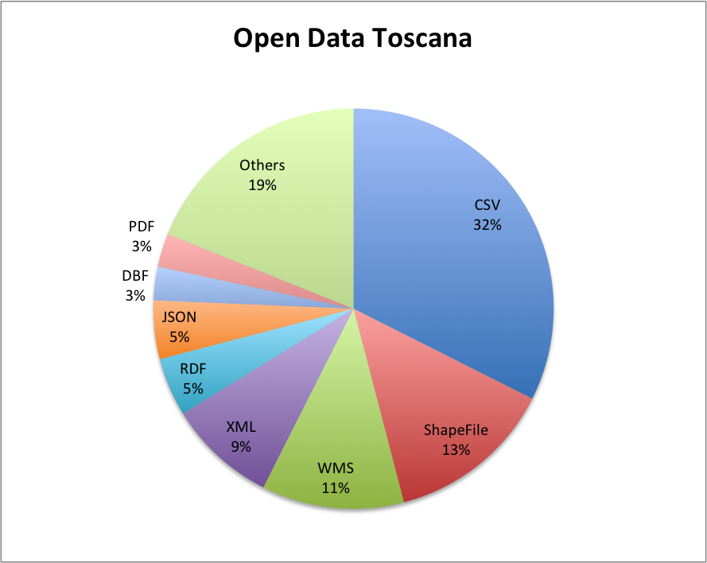
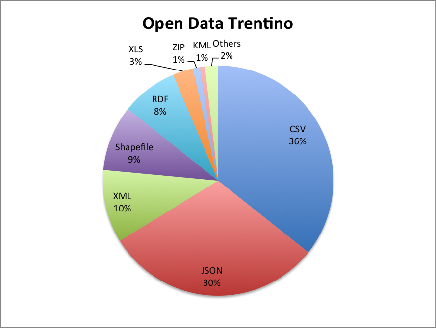

# Use cases and data specified, data modeled and prepared

Deliverable 1.1

## Document History

| Ver.  | Name            | Date        | Remark                              |
|-------|-----------------|-------------|-------------------------------------|
| v0.1  | Adrian Gschwend | 24.11.2014  | Created initial structure           |
| v0.2  | Adrian Gschwend | 25.11.2014  | Added first chapter                 |
| v0.3  | Adrian Gschwend | 01.12.2014  | First spellcheck, more content      |
| v0.4  | Adrian Gschwend | 02.12.2014  | Ongoing work on user stories        |
| v0.5  | Adrian Gschwend | 03.12.2014  | Added schema chapter                |
| v0.6  | Adrian Gschwend | 04.12.2014  | More work on schema chapter         |
| v0.7  | Adrian Gschwend | 15.12.2014  | Added Roadmap                       |
| v0.8  | Adrian Gschwend | 16.12.2014  | License section, PaaS               |
| v0.9  | Adrian Gschwend | 29.12.2014  | Feedback M. Combetto                |
| v0.10 | Adrian Gschwend | 30.12.2014  | Cleanup of open issues              |
| v0.11 | Adrian Gschwend | 31.12.2014  | Added introduction, reorganized chapters |
| v1.0 | Adrian Gschwend | 05.01.2015  | Executive Summary, small fixes      |
| v1.1 | Adrian Gschwend | 08.01.2015  | Added Motivation based on reviewer feedback  |
| v1.2 | Adrian Gschwend | 10.01.2015  | Last feedback from reviewers  |
| v1.3 | Adrian Gschwend | 16.03.2015  | Adding use cases based on midterm review feedback |  
| v1.4 | Adrian Gschwend | 14.04.2015  | More use cases for WWW2015 |  
| v1.5 | Johannes Hercher | 08.06.2015 | Use Case: Library Keyword Clustering |

## Documentation Information

* *Deliverable Nr Title*: D1.1 Use cases and data specified, data modeled and prepared
* *Lead*: Adrian Gschwend (BUAS)
* *Authors*: Adrian Gschwend (BUAS)
* *Publication Level*: Public

### Document Context Information

* *Project (Title/Number)*: Fusepool P3 (609696)
* *Work Package / Task*: WP1 / T1.1, T1,2, T1,3, T1.4
* *Responsible person and project partner*: Adrian Gschwend (BUAS)

### Quality Assurance / Review

* 1st: Marco Combetto
* 2nd: Davide Bruno

### Official Citation

Fusepool-P3-D1.1

### Copyright

This document contains material, which is the copyright of certain
Fusepool P3 consortium parties.

This work is licensed under the Creative Commons Attribution 4.0 International License. To view a copy of this license, visit http://creativecommons.org/licenses/by/4.0/.

## Executive Summary

The goal of Fusepool P3 project is to make publishing and processing of open data as linked data easy. For this purpose Fusepool P3 develops a set of software components that integrate seamlessly by well-defined APIs basing on Linked Data Best Practices and the Linked Data Platform standard.

The Fusepool P3 project partners Provincia Autonoma di Trento (PAT) and Regione Toscana (RET) have been publishing open data and are supporting the development of applications and services in the tourism domain for several months. During this time both partners gained valuable experience in data creation, maintenance and publication.

To ensure that the Fusepool P3 platform provides software that solves real world problems and provides added value for present and potential stakeholders, we enter into a dialogue with PAT and RET. This supports us in identifying problems they have in publishing open data and define use cases where Linked Open Data provides an additional value to them and the ultimate user of the data: Tourists visiting the regions.

Our platform integrates state-of-the-art tools like OpenRefine, OpenLink Virtuoso, Apache Stanbol, and Pundit. The P3 platform is developed and tested based on the requirements defined by our project partners PAT and RET within this work package. Both partners have started working with the platform in an early stage and feedback gets directly integrated into the agile development process of Fusepool P3.

To support PAT and RET in transforming their data to RDF, we propose various schemas and ontologies that are appropriate for open data published by them. We also provide a public platform as a service to minimize the technical knowledge needed for present or potential stakeholders and thus to encourage adoption of the Fusepool P3 platform.

This document describes the tasks specified in Fusepool P3 DOW work package 1: Use cases. It consists of deliverable D1.1 (Use cases and data specified, data modeled and prepared) and the tasks T1.1, T1.2, T1.3 and T1.4.

## Acronyms and Abbreviations

| Acronym |                 Description                  |
|---------|----------------------------------------------|
| ACL     | Access Control List                          |
| API     | Application Programming Interface            |
| BUAS    | Bern University of Applied Sciences          |
| CKAN    | Comprehensive Knowledge Archive Network      |
| CSV     | Comma-separated Values                       |
| ETL     | Extract, Transform, Load                     |
| FP3     | Fusepool P3                                  |
| GIS     | Geographic information system                |
| GML     | Geography Markup Language                    | 
| GTFS    | General Transit Feed Specification           |
| HTTP    | Hypertext Transfer Protocol                  |
| HTTPS   | Secure Hypertext Transfer Protocol           |
| IRI     | Internationalized Resource Identifier        |
| UI      | User Interface                               |
| JSON    | JavaScript Object Notation                   |
| JSON-LD | JSON for Linking Data                        |   
| KML     | Keyhole Markup Language                      |
| LDP     | Linked Data Platform                         |
| LDP-BC  | Linked Data Platform Basic Container         |
| LDPC    | Linked Data Platform Container               |
| LDP-DC  | Linked Data Platform Direct Container        |
| LDP-IC  | Linked Data Platform Indirect Container      |
| LDP-NR  | Linked Data Platform Non-RDF Source          |
| LDPR    | Linked Data Platform Resource                |
| LDP-RS  | Linked Data Platform RDF Source              |
| PaaS    | Platform as a Service                        |
| PAT     | Provincia Autonoma di Trento                 |
| POI     | Point of interest                            |
| RDF     | Resource Description Framework               |
| RDFa    | RDF in Attributes                            |
| RDFS    | RDF Schema                                   |
| REST    | Representational State Transfer              |
| RET     | Regione Toscana                              |
| SEO     | Search engine optimization                   |
| SPARQL  | SPARQL Protocol and RDF Query Language       |
| SQL     | Structured Query Language                    |
| URI     | Uniform Resource Identifier                  |
| URL     | Uniform Resource Locator                     |
| W3C     | World Wide Web Consortium                    |
| WG      | Working Group                                |
| WP      | Work Package                                 |
| XML     | Extensible Markup Language                   |

## Normative namespaces

In this document the prefixes used in [CURIEs](http://www.w3.org/TR/curie/) shall refer the following IRI prefixed:

| Prefix | Namespace|
|--------|----------|
| dc | [http://purl.org/dc/elements/1.1/](http://purl.org/dc/elements/1.1/) |
| dcat  | [http://www.w3.org/ns/dcat#](http://www.w3.org/ns/dcat#) |
| dcterms | [http://purl.org/dc/terms/](http://purl.org/dc/terms/) |
| eldp   | [http://vocab.fusepool.info/eldp\#](http://vocab.fusepool.info/eldp#) |
| fam    | [http://vocab.fusepool.info/fam\#](http://vocab.fusepool.info/fam#) |
| fp3    | [http://vocab.fusepool.info/fp3\#](http://vocab.fusepool.info/fp3#) 
| geo    | [http://www.w3.org/2003/01/geo/wgs84_pos#](http://www.w3.org/2003/01/geo/wgs84_pos#) |
| gn | [http://www.geonames.org/ontology#](http://www.geonames.org/ontology#) |
| gtfs  | [http://vocab.gtfs.org/terms#](http://vocab.gtfs.org/terms#) |
| ldp    | [http://www.w3.org/ns/ldp\#](http://www.w3.org/ns/ldp#) |
| oa     | [http://www.w3.org/ns/oa\#](http://www.w3.org/ns/oa#) |
| prov  | [http://www.w3.org/ns/prov#](http://www.w3.org/ns/prov#) |
| rdf    | [http://www.w3.org/1999/02/22-rdf-syntax-ns\#](http://www.w3.org/1999/02/22-rdf-syntax-ns) |
| rdfs   | [http://www.w3.org/2000/01/rdf-schema\#](http://www.w3.org/2000/01/rdf-schema) |
| schema    | [http://schema.org/](http://schema.org/) |
| shw | [http://paul.staroch.name/thesis/SmartHomeWeather.owl#](http://paul.staroch.name/thesis/SmartHomeWeather.owl#) |
| sioc | [http://rdfs.org/sioc/ns#](http://rdfs.org/sioc/ns#) |
| trans  | [http://vocab.fusepool.info/transformer\#](http://vocab.fusepool.info/transformer#) |
| void  | [http://rdfs.org/ns/void#](http://rdfs.org/ns/void#) |
| xsd    | [http://www.w3.org/2001/XMLSchema\#](http://www.w3.org/2001/XMLSchema)  |

## Stakeholder

| Name                 | Company/Organization         | Role     |
|----------------------|------------------------------|----------|
| Walter Volpi         | Regione Toscana              | Open Data Working Group Regione Toscana |
| Davide Bruno         | Regione Toscana              | Open Data Working Group Regione Toscana |
| Marco Combetto       | Informatica Trentina (PAT in-house company) | Open Innovation Management and Living Lab Coordinator |
| Francesca Gleria     | Provincia Autonoma di Trento | PAT Open Data Project Coordinator |
| Roberto Pizzicanella | Provincia Autonoma di Trento | PAT Tourism and Culture Department CIO |

## Introduction

This document describes the tasks specified in Fusepool P3 DOW work package 1: Use cases. It consists of deliverable D1.1 (Use cases and data specified, data modeled and prepared) and the tasks T1.1, T1.2, T1.3 and T1.4. For better readability, this document repeats the basic definition of the tasks according to the DOW. All tasks are due in M12.

The main goal of the Fusepool P3 WP1 is to define use cases with the project partners Provincia Autonoma di Trento (PAT) and Regione Toscana (RET). This is needed to make sure that the Fusepool P3 platform provides software that solves real world problems and provides added value for present and potential stakeholders.

## User Requirements and Data Identification

>T1.1 - User requirements: identify key stakeholders, conduct in-depth interviews in the tourism related field; map requirements and expectations to functionality and develop use scenarios based on these requirements to form the basis of conceptual and functional test models.

>T1.2 - Identify the data. Select potentially value-adding data sources based on application scenarios and use cases that a) provide a concrete benefit for the public agencies and SMEs, b) are likely to be re-used by others and c) integrate well into the existing Linked Data cloud.

----

### Motivation

To assure that Fusepool P3 creates a real value for the involved project partners and new stakeholders, it is essential to understand their motivation and needs. The Fusepool P3 project partners Provincia Autonoma di Trento (PAT) and Regione Toscana (RET) have been publishing open data[^opendata] and are supporting the development of applications and services in the tourism domain for several months. During this time both partners gained valuable experience in data creation, maintenance and publication.

Public administrations are used to provide services for citizens for a long time. With the introduction of information technology in the seventies, many of these services started to get automated and more centralized. With the advent and later the great the success of the Internet, many administrations now provide vertically focused web portals, mobile apps, etc.

At the same time administrations realized that they couldn’t provide a service for everything by themself, even if they have many more data sets in internal systems that might be useful to the public; it would simply be too expensive to do all of this by the administration. The Open Data movement at the same time started propagating opening up locked data sets to the public. If administrations start to publish data they enable third parties to provide additional services that might be useful for the public.

After publishing first open data sets the administrations realized that there could be additional value in the data if the datasets from different sources and systems would be (inter-)linked with each other. In this document we will give examples about this interlinking in the field of tourism but this is true for many more data sets available.

PAT and RET first started publishing data sets which were considered strategic. In Italy in general but also in the two regions Tuscany and Trentino the most important business is clearly tourism. This also includes linked and related industrial activities around tourism. Thus the regions are struggling with one particular question: How can they support and push tourism by changing their daily operations and if necessary, oneself. 

Based on this question Trentino 2012 started to publish data as open data; particularly related to tourism, culture, and geographical data.

In July 2012 the Tuscany Region started opening up data, involving authorities, citizens and businesses. The data is published on a public platform and mainly released under a Creative Commons license.

Starting from January 2013 the Tuscany Region officially committed to the implementation and management of an open data platform with the goal to disseminate data from the region and other regional governments.

To realize this initiative the administration is using the following tools:

* Guidelines containing general criteria for open data in the Tuscany Region (approved by Resolution of the Regional Toscana 21 January 2013, n.23)
    * Explain to the public what open data is and why it is important. This includes explaining the purpose, its limitations and how the goals will be reached.
    * Establish the routes to be taken inside and outside the administration.
* Providing a platform for the management and processing of data in open formats.
* Section on the corporate website dedicated to open data, fed directly from the platform itself.
* Working group composed of competent professionals in the various sectors involved in the project (ICT, lawyers, communicators).
* License that gives the user the ability to reproduce, distribute, transmit and adapt the data freely even for commercial purposes, provided the source is acknowledged.

With the launch of a new portal called Open Toscana in September 2014, the administration is also adopting a "dataset on-demand" approach: if somebody asks for data that is not yet released, government staff will try to respond, and publish it within a month at most. 

Similar steps were taken within the Trentino Open Data project:

* Guidelines containing general criteria for open data in the Provincia Autonoma di Trento (approved by resolution of the PAT on 27 December 2011, n.2858)
* Explain to the public what open data is and why it is important.
* Establish the routes to be taken inside the Trentino System (province, municipalities, public owned companies, other bodies).
* Define the data format,  required metadata and licenses to be used
* Startup of the Opendata Trentino project[^ckanpat], leaded by PAT. Involving Informatica Trentina, Trento Rise, FBK and University of Trento; with the aim to provide a platform, establish processes for the selection, management and processing and publishing of data in open.
* Creation of a PAT working group composed of competent professionals inside PAT in the related field, in order to oversee the overall initiatives (statistics, innovation, legal affairs, etc.)

But the regions realized that publishing data itself is not enough, they also need to link them in better ways. There is far more knowledge in the data that could get exploited by companies and startups if this knowledge is easily accessible.

The regions also hope to change the culture in administrations in positive ways. Currently many administrations seem to be afraid of opening up data, for example because one could find errors in the public data sets. By showing them that third parties start to use their data in a different, productive way they can slowly change this culture and motivate administrations to release even more data. Providing the right set of technologies that facilitates the open data publishing process also supports this culture change.

### Use Cases

To answer the questions risen in T1.1 we had to enter into a dialogue with PAT and RET to understand what, why and how they publish open data about their provinces. The provinces are represented by multiple persons working for them. All of them are at the end of the publishing chain and responsible for publishing data sets from other divisions and groups as open data. Changes in the data sets can be requested but our partners have limited influence on if and how fast this will happen. All of them work with IT and have a profound technical understanding of what is needed to publish open data. While they do see the potential, they do not have a lot of hands-on experience with Linked Data yet; this is one of the motivations for them to be partner in Fusepool P3.

As of today both partners provide an open data portal[^ckanret][^ckanpat] based on CKAN[^ckan] repository. CKAN is a data management system aimed at data publishers wanting to make their data open and available. It provides tools to facilitate this publishing step and helps finding and using data. The data quality completely depends on the data provider. There is no additional work done on the data sets except adding some meta information. The data that gets pushed into the system is the data which is made available to the user.

Currently available open data by PAT and RET is available in particular data formats like CSV, KML, XML and JSON. App developers need to download the raw data and process it using their own ETL (Extract, Transform, Load) processes. Many of the published open data sets are used in Android or iOS apps aimed at tourists and/or inhabitants of the region. Some of them are written by the project partners, other apps by 3rd party developers which integrate parts of the published open data into their own apps. With every update of the raw data the ETL process has to be triggered for every single application where it is used. If the format of the raw data changed, the process has to be adjusted and cannot be automated. With every new data source, maintenance complexity of these open data sets and its apps increases.

In interviews with PAT and RET it became clear, that this is one of the big obstacles of the current approach. There is far more knowledge in these data sets available than what is visible and accessible to the open data developer.
This is best explained by the example of Via Francigena[^viafrancigena], an ancient road and pilgrim route running from France to Rome. In their geographic information system (GIS) RET collects many point of interest (POI) around this ancient road[^fragis]. This dataset is made available to the public but the data alone does not tell the full story of the POI. 

The term point of interest is very generic: It can be something obviously useful in this context like a restaurant or a hotel along the road. A bit less obvious but still useful are other examples like pharmacies where one can treat its blisters from walking or public wireless access to upload the latest pictures to Facebook and Instagram. But a point of interest can also be a snippet of plain text that puts the POI into a historical context. Using this kind of information in a generic, re-usable way is technically much more difficult than the obvious examples. A plaintext example could be that a famous person ate this specific dish back in the days and it became a signature dish since then. As a tourist I might want to know which restaurant along the way provides this dish and where I can buy the particular ingredient for taking it home.

From the *Via Francigena* homepage[^viafrancigenahp]:

>  It's a space created to give value to responsible tourism: a tourism that enhances the cultural, environmental and historical heritage of the historic path, creating opportunities for small enterprises and for a conscious development of the territory. 

The key point of the Fusepool P3 use cases is to use Linked Open Data as an enabling technology that can link together tourism data with cultural data and mobility data. Our stakeholders talk about an “Extended Touristic Experience”.

As mentioned before data is available in many different formats. In best case for the app developer the data format is standardized and well supported in ETL tools. Unfortunately this is rarely the case as every data user has his own, mostly proprietary data management tool or application for maintaining it. This can be well seen in the available datasets from the two provinces PAT and RET. There are a few standardized and semantically meaningful data sets in formats like KML[^kml] or Shapefile[^shapefile], which are used for expressing geographic annotation and visualization. In between that there are semantically still quite valuable XML formats. One example is weather data[^weather] about the province, although in a non-standard schema and using Italian identifiers for the XML elements. The vast majority of the data is available in semantically poor data formats like CSV or JSON (as of 24.11.2014).

The terms "semantically meaningful" and "semantically poor" are indicators of how much work is needed to do something useful within for example a mobile application. Reading, or in app developer terms parsing data in a certain format is just the first and often the easier step. Once the data is in a structure the app developer can handle, she needs to figure out what the data is about, or in other words understand its semantics. This is where the real work starts and this is harder in semantically poor data formats like CSV and JSON, as the indication about what the field value really means is completely up to the one providing the data and if available, often hard to understand for others.

This is one of the main remarks when talking with PAT and RET: While a lot of data is available it lacks even the most basic form of relationship between the different data sets. They explained it on the example of Tripadvisor: While they have an impressive dataset for certain kind of data, it is not possible to relate it properly with for example Via Francigena. These are the kind of challenges they would like to see solved with Linked Data and that is where they need support by a tool. 

Another example from PAT and RET shows how this can be useful for app developers and in the end for tourists visiting the regions. To promote local wines both regions provide a website called *Strada del Vino*, where one can find information about specific wines its wine yards. The two websites[^winepat][^wineret] are completely independent of each other and look pretty much different. In PAT there are more websites, among them *VisitTrentino*[^visittrentino], the official website for Trentino tourism and *TasteTrentino*[^tastetrentino], which provide data for *Strada del Vino* as well. Also most of the content is only available in Italian language excluding visitors from other countries which minimal or no Italian skills. Solutions for the future need to support multiple languages; RDF can facilitate this process by providing a data model which supports multiple languages by design.

From a data perspective, it would probably be quite straightforward to generalize the information that is made available for the tourist. It could consists of:

* Spatial datasets, providing shapes and/or coordinates of
    - Wine yards, cheese makers, apple producers
    - Wine regions
    - Wine cellars, agricultural tours, events
* Metadata for those data sets like
    - Who provides wine tasting
    - Ratings & prices won by wine yards
    - Pricing, price-ranges
    - Opening hours where appropriate
    - Information about shipping to foreign/overseas countries
    - Import/tax restrictions for foreign countries
    - Information about distributors of this particular wine in foreign countries
* Generic information about wine like
    - Types and explanations of different raisins
    - Characters of wine, related to what is available in the region
    - Some historical context (could be plaintext)
    - Linking a specific wine with certain types of meals
    - Special offers which are available (obviously liked with where)
    - Information about rare and special wines, for example addressed at wine connoisseur
    - Which wines did Julius Caesar drink while building the Roman Empire

*Strada del Vino* in RET and *TasteTrentino* in PAT just contain of and show a small subset of this data. Not all information might be available as of now but this is mainly related to the fact that it is just too much work to create a proprietary application for each region. Linked Data can change this as every region would use the same schemas for describing the data and an application developer could easily add new regions that provide the necessary data sets. It would also motivate wine yards, farmers, agricultural tour providers, breeders and other tourist facilities to provide more information about them to get better visibility in the application and thus generate more revenue. Instead of just providing the raw data about them they can and should also link to related content, which is available in the Linked Data Cloud. This will increase the value of POIs and events and, at the same time, enable those POIs and events to return more interesting results to the tourist/consumer of the data and again increasing visibility and outreach for the independent tourist facilities.

### Datasets and use cases

#### Introduction

The use cases of Fusepool P3 are not limited to those presented in this document. However, within the project runtime it is only realistic to work with a subset of data available. Additional data sets that could be transformed to Linked Open Data are:

* Additional mobility data: Real time data (traffic, bus position etc.), bike sharing, car rental etc.
* All kind of accommodations
* Museums
* Recipes from the region
* Cultural heritage as documented in archives and libraries
* Wireless hotspots
* Street index
* Ski areas
* Sport facilities
* Architectural & artistic places
* Archeological places
* Libraries
* Company register

Our goal is to support PAT and RET as good as possible in transforming those datasets to Linked Open Data. The complete list with links to the data set is published in the web[^odatacat].

#### Use Cases

##### POI and Events during a certain timeframe

A tourist wants to visits the region. She can visit a web page or app where she enters the place she wants to stay and the time frame. She gets recommendations for Accommodations, Restaurants, Museums and Events during this time frame. This should make it possible to plan her trip more accurately as she might chose a certain town during (or not during) an event taking place. There might be an ICE (In Case of Emergency) button that shows here the nearest pharmacy as well.

During popular events there are usually far more tourists and the prices are higher, which can be a reason to not visit this place at a certain time.

Point for point description:

* Load the demo URL
* Zoom in/out to find the location she wants to go
* Tap/drop on the location, this sets a pin on the map
* Move the pin if necessary
* Enter a time frame (optional)
* Click on a "Show more..." button to execute the query
* Show POIs on the map around the pin
* If there was no result, give a feedback that nothing was found
* If there is a result, adjust the query on zoom out so we can see more results

Bonus:

* Show different kind of colors based on what type of result it is (hotel, accommodation, restaurant etc.)
* Provide a dropdown or alike where I can select which types of result I want to see.
* Provide a ICE (In case of Emergency) button, which shows the 2-3 nearest pharmacies

##### Address to spatial mapping

Most of the published data sets only provide an address of the point of interest and no geo coordinates with latitude/longitude values. To be able to query those POIs based on a location it is necessary to map them to latitude/longitude values in WGS84 vocabulary. Google is probably the most widely used service to offer this but the terms of use forbid use of the results outside of displaying it on Google Maps. 

Fusepool P3 needs to provide a comparable service, which can be used for any kind of data without any usage restrictions.

Requirements:

* Provide a service that can do this based on any location on the world, preferably on open data like Openstreetmap.
* If there are better/more complete alternatives with an appropriate license for a specific country/region, it should be possible to use this service instead.

##### Enhancing textual content 

A considerable amount of data is available in plaintext form, for example descriptions about events, people, locations or monuments. Many of these descriptions are only available in Italian language. Some of the data sets provide a certain amount of keywords that can be used for search. Those terms are again mainly available in Italian language and many data sets do not provide any keywords at all.

Performing automated linking to other content can greatly improve searchability of the content, especially when done using data sources like Wikipedia/DBpedia or Wikidata.

Requirements:

* Detect language
* Interlink content with appropriate Wikipedia/DBpedia terms
* Perform named entity extraction on custom thesauri/vocabularies if available 

##### Food and Wine

One of many reasons to visit Italy is its culinary offer. During the visit of Italian cities and villages tourists visit many restaurants and get to known to the local cuisine. Many of the specialties that are offered are hard to find outside Italy so tourists want to buy a particular parma ham, parmigiano, wine or salami to take it home.

It is not easy to find a specific wine, cheese or meat in one of the many shops or markets available due to the almost overwhelming choice available. Producers and vendors of those specialties can increase sales when they provide detailed information about the available specialties and their point of sale.

Requirements:

* Provide a list of specialties as a taxonomy TODO, including translations to other languages and short descriptions.
* Interlink those taxonomies with external datasets like DBpedia or Wikidata.
* In a second step provide tools which allow producers, sellers, restaurants and hotels to provide additional open data about where the offered specialties can be found.

##### Opening hours

Most of the currently available Open Data in the regions does not provide machine readable opening hours. Schema.org provides the necessary vocabulary to provide this kind of data.

Requirements:

* Provide opening hours as microdata within the web site of the location.
* Or within within/next to the original data set.
* In case it is a web site, provide a link to it and harvest microdata on a regular base and integrate it into the platform.

##### Weather forecasts

While some of the tourist locations are always popular no matter what the weather is doing there are others where weather influences if a visit to a certain location is more or less appropriate within a trip. In case of inapt weather there are alternatives which can be proposed to the user.

Requirements:

* Add preferred weather information to point of interests
* Link to alternatives in case of inapt weather
* Provide weather forecasts as Linked Data

##### Bologna Tourist Guide L'Ospite di Bologna

Many Italian towns provide printed tourist guides, one example is [L'Ospite di Bologna](http://www.ospitedibologna.it/). This particular guide for the town of Bologna exists since 32 years and provides information about landmarks, museums, events, restaurants and so on. A big part of the information is available in Italian and English language, some only in Italian. The content of the guide is detailed and well written and a valuable source of information for culturally interested tourists.

While the guide does provide addresses, phone numbers and even a small map it is not very appealing for younger tourists which travel with smartphones and tablets. The website itself is not optimized for tablets and smartphones which makes interacting with it very difficult. It also completely lacks any machine readable information as microdata.

By providing all this well maintained content as raw data it could be better integrated:

* Provide latitude/longitude for all point of interests
* Extract third party keywords (like DBpedia) on the textual content for better interlinking and searchability
* Translate content to other languages
* Make events searchable
* Increase visibility for hotels, restaurants etc.

##### City Point of Interest

Among Italian cities there are fixed point of interest descriptions at various locations. These short descriptions provide information about the specific building or monument. Many of these descriptions are only available in Italian language and thus of limited use for foreign tourists.

They could be made available by the cities with geo location. Other users of the Fusepool P3 platform could translate this information to other languages and integrate them into apps for tourists.

Requirements:

* Provide a list of all point of interests and their descriptions
* Add spatial information to it
* Enhance the textual content for better searchability

##### Public Wifi Locations

Among others Florence is providing public Wifi hotspots. This [list of Wifi hotspots](http://dati.toscana.it/dataset/punti-accesso-wifi-citta-metropolitana-di-firenze) should be made available as Linked Data so it can be easily used and integrated by third parties. 

Requirements:

* Transform the available data to Linked Data

##### Museo Galileo di Firenze

The Galileo Museum in Florence is providing a [catalogue of pieces](http://dati.toscana.it/dataset/banca-dati-museo-galileo-strumenti-libri-fotografie-documenti) as Linked Data. The catalogue is not interlinked with external datasets and thus difficult to search and relate to. Interlinking it to external data sources improves searchability of the content.

Requirements:

* Interlink the textual descriptions (mainly titles) with external data sources like Wikipedia/DBpedia, Wikidata and custom thesauri/vocabularies if available

##### OpenExpo2015

TODO add story about [OpenExpo2015](http://dati.openexpo2015.it/) (told by Matteo Brunati, SPAZIO)

### Large Scale Validation Use Case: Library Keyword Clustering 

#### Introduction <!-- Libraries under pressure and work is'nt recognized --> 
Libraries are under pressure. With the advent of the Internet most of the metadata of e.g. text books are available through amazon, google scholar, or the publishers itselve, which causes that the usage of library (e-)resources declines. Although librarians put much intellectual effort into the description of contents with controlled vocabularies ([Authority Files][]), their benefits to the end users are rarely visible.

Librarians put much effort into the acquistion and management of library resources. While thousands of librarians are in charge to handle licensing concerns, loan management, cataloguing, and exchange of basic metadata between libraries, they pay only little attention to enhance the intellectual process content description (subject indexing). <!-- Similarly, only few initiatives are known that harness and extend Authorities' semantics to provide new search features that focus on explorative search and browsing tools for the end users (patrons). -->
<!-- structure of the document goes here --> 
We organize this report as follows. To underline the importance of the presented usecase we recon the process of subject indexing from a librarians perspective, identify needs, and outline intentions to improve both the librarians' and patrons' situation. We present the recommended developments together with a short analysis of their outcome for the stakeholders, and related them to the necessity of a tool (FP3 plattform), that is capable to consolidate multiple data processing and update tasks in a unified workflow.

#### Librarians perspective  <!-- introducing kate -->
Kate Tagalot is a subject librarian at a big university library. Most of her work day she decides which books to aquire and  enhances their basic bibliographic metadata (title, author, publication year, etc.) with keywords that describe their contents. Kate's customers highly appreciate her work, because she allows them to find books well organized in [subject categories][], no matter which languages or century they're written in, nor which words their authors use to [describe a topic][]. Kate quickly gets the gist of a publication and translates their contents into a controlled vocabulary, which in turn allows users to easily access all publications relevant to a certain area of interest (topic). The keywords she assigns also support her users in browsing or narrowing down their search. It's noteworthy that every keyword she assigns has a unique identifier, a clear definition, and includes semantic relations (i.e. broader, narrower, or related). To distinguish them from uncontrolled keywords (i.e. Tags) we refer to the term subject heading, or *concept* for short. <!-- in the remainder of this document. --> 

<!--  # Kates Tasks and workflow -->
When Kate indexes a new Book, she **skimms though** the title, TOC and description of a book to compile a list of potential terms a user could type into the search engine. She **looks up the candidate terms** in the [Authority Files][], e.g. the [catalogue of the national library](http://d-nb.de), to find an uniqe identifier for each keyword. Accordingly, she needs to **read scope notes** and reference materials (e.g. Wikipedia) to get a thorough understanding of their meaning. Also, she tests the choosen concepts on coherence with the previous indexing practice, and looks for similar books to check if their subject headings are useful too. To abide the library's policy she needs to:

 - Pick at least two concepts from the GND-Authority-File (thesaurus) that should have different entity types, i.e. Persons, Locations, Time-aspects, Things or Technologies, and Topics.
 - Pick at least one Subject-Class from a hierarchical Classification ([RVK][] or [DDC][]).
<!-- - Build compund chains of keywords to express the contents of the publication. -->
 - Pick at least one concept from a specialized terminology of the subject area, i.e. she uses [STW][] for business sciences, [MesH][] for biology, [CAS][] for Chemistry, [theSoz][] for social sciences, etc. A comprehensive list of other subject terminologies is retrievable at [BARTOC][].
 
The work she does is not necessarly linear. She might start with searching for similar records, or already knows a subject heading to describe the publication at hand. She might harness the semantic relations of a relevant concept to find related ones or similar books. At any time of the indexing process she looks up unknown words, reads extracts from the publications' contents, and refines her candidates list. All tasks together are best described as iterative process of learning. Not only about the contents of the publication, but the topic itselfe. While she indexes publications she also maintains the [Authority Files][] in collaboration with other university libaries, i.e. extending a subject heading with synonyms or by coining new terms that yet not covered by the Authorities.  <!-- And she may also serendipitously find books to aquire for her subject areas. -->
<!-- Kate needs assistance --> 
According to the time and tools she has, the quality of description may vary. Each day Kate indexes around 20 Books, and much of the time she is looking up information from different websites and services. Therefore she wants her IT department to support her with: 
 
  - Aggregation of the semantics, usage and background information of a concept from Wikipedia/DBpedia, library catalogues, and Authority files joined in a single webpage.
  - Suggestions of possible keywords from the national Authority File ([GND][]), foreign Authorities (e.g. [LCSH][] at the Library of Congress), and concepts from specialized subject thesauruses (e.g. [STW][], [theSoz][], [MesH][] and others).
  
<!-- Reasons: Why her IT department refuses the job? -->
Although Libary Data, and most of the Subject Terminologies are accessible free of charge kate is not able to explore the contexts of her candidate concepts in a systematic way at a single service or central hub. <!-- - access to aggregated information at a single service is needed but, -->  From a technical perspective this has the following reasons:
 
 - Huge Datasets require much computing power but kate has only a small machine at the workplace
 - Different hubs offer the data using various formats and protocols. 
  <!-- - Unterschiedliche und konkurrierende Ansätze für Datenmanagement. --> 
 - Multiple steps needed to process the data, and it should to re-run on updates of the datasets analyzed.
 - Missing tools that can combine multiple steps and different tools into unified workflows.

<!-- Why Fusepool how is the plattform used? --> 
#### Why Fusepool & Objectives
 <!-- fp3 capabilities --> 
The platform developed by the FP3 project provides new methods to streamline multiple operations into one workflow.  

 `…other key features of FP3 Plattform may be added here`

 <!-- introducing the objectives of this usecase --> 
Hence it is more convenient to reach the objectives, shortly described in the following sections. More technical information about the processing are to be published in [DeliverableXX][]. 

##### (A) Aggregation of Information from Catalogues, GND and DBpedia 
<!-- Aggregation of information about and arround concepts to support subject indexing with a more complete view on a topic. -->
The Authority Files used do provide rich semantics, but the process of manual subject indexing is cumbersome. During indexing a librarian enters an iterative process of learning about a topic. In order to express the contents of a publication with a controlled vocabulary she needs to looks up scope notes and follows semantic trails of a subject headings, she performs searches in different library catalogues and learns about the context by the help of encyclopedias online. While a subject librarian quickly gets the gist of a publication, her work could be drastically supported if she isn't forced to collect information from multiple places. More precisely she has to aggregate the following information by herselfe:

  - About the concept itselfe, i.e. scope notes, semantic relations, concordance to other vocabularies ([DDC][], [RVK][], [STW][], [theSoz][]).
  - About their meaning, i.e. descriptions, images, maps (geocodes) from Wikipedia/DBpedia.
  - About the usage and context, i.e. what kind of records link to a certain concept and what concepts appear in conjunction in this record.

Integration of the described information is feasible for technically educated people, since most of the sources publish their data in compliance to the [Linked Open Data Principles][]. Unfortunately, Kate has not the knowledge of e.g. SPARQL to perform complex queries, or to transform the data according to her needs. Also most data providers in the library domain don't update their LOD datasets in a timely manner. For instance The data LOD dump of GND updates twice a year. To get timely updates it is required to access distributed data providers' customized formats (e.g. MARC, MAB, PICA for library records), and transport protocols (e.g. SPARQL, SRU, Z39.50).

In turn this is a complicated situation for a software developer that needs to make sure that everything is in place and updated in a reliable workflow. Also, having the data at a central hub makes it more convenient to access information with less http-requests, and therefore speeds up data intensive apps. Developers might be easily able to build interfaces on the data to browse Authorities.

Within this objective FP3 plattform shows its fittnis to process huge data sets and to integrate data from multiple sources. More precisely a union catalogue for library data ([b3kat](http://lod.b3kat.de)), an Authority File ([GND][]), and data from [DBpedia][]. Transformation and update routines are not implemented, due to their complexity and limited time within the project.

###### (B) Analyze of coocurrences of concepts (keyword cluster) 
 
 <!-- …nach oben !! coocurrence
but get a holistic view on   a concepts' context. Coocurrence Analysis of Concepts / Keywords helps cataloguers to gain insight on how a concept may be used with supplementary keywords. An immediate access to clusters of related concepts can be used for verifying and extending the clusters' members with further semantic relations, such as `skos:related`, `skos:narrower`, or matches to concepts from other terminologies. The intended clusters can be also used to build new recommendation services, that support libraries' patrons in exploratory search strategies. 
  --> 
 
The main goal of this objective is the generation of new semantic relations between kewords (concepts) based on their coocurrence in multiple records of a union catalogue ([b3kat](http://lod.b3kat.org)). To find coocurrent concepts we gather records that have a certain concept (e.g. ["Hanns Eissler"](gnd:118529692) or ["states and music"](loc:sh85088892) attached (as `dc:subject`). We collect all occuring concepts from the result set. The count of appearance relative to the base-concept measures the distance between both concepts (cf. [figure below](#keywordcluster_bsp)).

![Example Keyword Cluster (red relations) generated from coocurence of keywords at one record ][keywordcluster_bsp]

[keywordcluster_bsp]: img/keywordCluster_Bsp.png "Example Keyword Cluster (red relations) generated from coocurence of subject headings "

 <!-- Benefits of cooc analysis --> 
Coocurrence analysis of concepts helps cataloguers to gain insight on how  to enrich a record with supplementary concepts, and is reasonably computed in advance. <!-- The [b3kat](http://lod.b3kat.org) has 26 mill records from 180 scientific libraries located in Bavaria, Berlin und Brandenburg. The set has ~890 mill Tripel and a size of ~7,7GB. All data is CC0 an available trough a [public sparql endpoint ](http://lod.b3kat.de/doc/de/sparql-endpoint/). -->  <!-- Also, the type of concept-identifier is retained (i.e. DDC, RVK, GND, LOC, ISBN, or plain text), to allow specific selection of certain concepts lateron. --> The dotted lines show subject headings as candidates to enrich the records connected. Coocurrence relations may be also used to:

 - **Enhance and verify exisiting relations**: Coocurrence relations of a certain degree may be selected for analysis by a domain expert, in order to compile new curated relations between the concepts (i.e. relations for narrower, broader, related relationships).
 - **Suggest Concepts that strongly occur together** to expand search strategies. For instance a search for Goethe could suggest keywords such as authors or topics from the respective context.
 - **Building concordance between concepts**: Coocurrences between concepts stemming from different terminologies/thesauri are usable to find candidates for alignment. It's also possible to suggest them during the subject indexing process to enrich the records.

###### (C) Build word-context's per concept.
To get a faster understanding about the semantics of a concept, it is useful to have an holistic overview about the <!-- refered as FRAME in linguistics! -->  words/terms used in conjunction with an identifier. Descriptive texts such as titles, abstracts, TOC's provide a viable source for this kind of word field analysis. We collect the records indexed with a particular concept and save descriptive texts into a *word-context-bag*. Afterwards we analyze the bag with Named Entity (NER) and Named Entiy Linking (NEL) tools, to spot entities. The count of occurrence of each term is retained as well as the type of each spotted entity (e.g. by: Person, Place, Time, Topic...). The word context (WC) is usable to: <!-- Benefits of Word Context building --> 

  - **Examine semantics of a concept**: During the indexing process librarians need <!-- to have a thorough understanding of the semantics of a concept, --> to decide if a particular subject heading suits to describe a certain topic. WC's can complement well-established concept relations to convey a better picture of a subject area. 
  - **Enrich Authoritiy Files**: WC's may be a viable source to find missing vocabulary, i.e. terms that aren't attached to a certain concept (i.e. as synonyms). Also, they may be of relevance to *coin new concepts*, if a WC contains specialized terms that are not covered by the Authorities. 
  - **Suggest Concepts based on text input** If an abstracts' word context  overlapps with the word context of a particular concept, this concept is a possible index term for the record at hand.   
  - **Suggest Concepts based on coocurence relations**: Because concepts coocur together with a certain degree this unveils new possibilities to search the library catalogue. For instance a search for "Goethe" may suggest keywords like: "Schiller, Weimar, or linguistics". The strenght of coocurence is usable to adjust the suggestions, based on their closeness to each other.  <!-- maybe insert a figure to express? --> 

#### Conclusion 
Libraries want to be competive to search engines on the web. Concerning new search features and to support resource intensive subject indexing we plan to (a) collect complementary information, (b) compute coocurrences, and (c) build word contexts of library keywords. The key challenge is to aggregate and transform distributed information from various locations in several steps, which is cumbersome if it comes to updates in the collaborative environment. The FP3 plattform consolidates the access to different datasources, computing-, and transformation steps into a unified workflow that is maintainable, and can re-run on a regular basis. The process should run without intervention of the libraries' IT staff after setup, hence making the described intentions more viable.

### The case for Linked Data

Linked Data addresses some of the mentioned problems users have with Open data. It does that by providing a standardized format (RDF) that provides among others the following benefits:

- Every piece of information (data) has its own identifier (URI/IRI).
- Those identifiers can be resolved via the web (HTTP),
- which acts as a generalized API for developers.
- Standardized vocabularies describe the meaning of the data,
- and allow to relate information with each other.
- SPARQL is its standardized querying language.
- Built-in support for multiple languages by using language-tagged string literals.

The Linked Data technology stack [Bizer2009] provides many ways to interact with data in RDF format [Cyganiak2014]. This greatly reduces the overhead needed to integrate data sets into apps and thus increases the value of open data. However, one needs new ETL processes to transform raw data to Linked Data. While it facilitates data usage for app developers, Linked Data requires initially more work by the data owner and publisher.

In the past years many powerful tools got developed or extended to support creation and maintenance of Linked Data. Also new W3C standards and vocabularies are developed for turning legacy data into Linked Data. Many of these tools and standards are developed, extended or implemented by Fusepool P3 project partners. The emerging Linked Data Platform Standard (LDP)[^ldpprimer] provide standardized means for making collections of linked data resources accessible.

What is lacking is an integration framework that combines the data transformation to RDF, possible enhancement steps and the publishing of the Linked Data. Fusepool P3 will provide such an integration framework along with User Interface tools that serve both to model the data publication process as well as to coordinate the human interactions that might be required while the data is processed.

This framework will integrate state-of-the-art tools like OpenRefine, OpenLink Virtuoso, Apache Stanbol, and Pundit. The framework is developed and tested based on the requirements by our project partners PAT and RET. Both partners have started working with the platform in an early stage and feedback gets directly integrated into the agile development process of Fusepool P3.

### Fusepool P3 Development Roadmap

Fusepool P3 aims at bringing the presented use cases into the reality. To do this we need to make sure that the platform provides the necessary features and usability so that PAT, RET and other stakeholders can use the Fusepool P3 platform in their environment. 

To get there, Fusepool P3 is using an agile development model that is oriented at the Scrum[^scrum] methodology. A rough development roadmap was presented and agreed on at the Salzburg project meetup in May 2014. The roadmap is based on The Go Product Roadmap[^goroadmap] and defines the following milestones.

The roadmap is permanent work in progress and gets updated accordingly. Based on WP1 requirements outlined in this document, the WP1 team fills the Fusepool P3 Jira Backlog[^p3jira] with user stories and defines Scrum sprints with the developers.

#### Bootstrap!

Timeframe: 1.1 - 7.5.2014

Goal: Build the team and get started.

Features:

* Website
* Agreement on technical architecture
* Integration of some partner tools
* Scrum methodology
* Contractual framework and roles established

Metrics:

* Everyone commits on common architectural principles
* The website represents the team, the partners, its diversity and the goals
* Everyone understands and participates to Scrum
* All roles are assigned
* Contractual framework ensures all partners can benefit from website (domains etc.) during and after the grant period

#### Spaceport

Timeframe: 8.Mai - 15.July 2014

Goal: First version of platform foundation implemented; Major REST APIs defined and prototype implementations available.

Features:

* Roadmap and backlog (T1.1)
* Some data sources identified and core ontologies determined (part of T1.2-T1.4)
* LDP Implemented
* First GUI
* First extractors

Metrics:

* Jira Backlog is filled with high-level stories
* LDP platform available
* Initial REST APIs defined and implemented

#### Neil Amstrong

Timeframe: 16.July - 5. October 2014            

Goal: User can start using the software for enrichment tasks; external developers can use our clearly defined REST APIs.      

Features:

* Basic REST APIs are defined an prototypically implemented
* First user documentation
* UI POC
* Deployment manual         

Metrics:

* User can setup and start a semantic enrichment process (on command line)
* Developers documentation available so they can implementing their own services
* First HTML5 based UI POCs available

#### ISS

Timeframe: 6.October 2014 - 5. February 2015        

Goal: Our software can be used by many people.    

Features:

* Stable REST APIs & documentation
* Full P3 workflow implemented
* Fusepool P3 platform instance available for PAT and RET

Metrics:

* Required use case schema/vocabularies are identified
* Project partners provide first examples in using the processing pipeline with PAT and RET datasets
* PAT and RET are able to integrate their own data sets into the pipeline
* Stable implementations of available transformers and enhancers

#### ULCS

Timeframe: 6. February - 5. June 2015        

Goal: The platform can handle large amounts of data.

Features:

* Stable platform that scales

Metrics:

* Large amount of datasets from PAT and RET are published as RDF
* Platform scales appropriately

#### Teleporter

Timeframe: 6. June - 2. October 2015        

Goal: Smooth and elegant data tools.

Features:

* Easy to understand UIs for all necessary steps available
* Schema/vocabulary integration & support for the user
* More transformers/enhancers (where appropriate)

Metrics:

* PAT and RET are using the platform actively
* Additional stakeholders are identified and partially start using the platform
* Public release of the platform, new users attracted

#### Opal

Timeframe: 3. October - 31. December 2015

Goal: Make it shine.

Features:

* Stable platform, easily deployable

Metrics:

* Stable release of the P3 platform
* Fusepool P3 is used outside the P3 consortium

## Data Modeling

>T1.3 - Model the data: Identify existing ontologies/vocabularies to model the data, agree on standard structural and descriptive metadata, and define data models that reuse existing approaches and schemas to model relational and other data sources. 

PAT and RET do not have much experience with RDF. There are a few datasets available in RDF but they use their own, ad-hoc schema and are thus of limited use and not actively maintained. To facilitate the process of creating RDF out of the other sources, they asked to get support in choosing and using the right schemas and ontologies.

Finding the most appropriate vocabulary, schema or ontology can be tricky. There is not necessarily one single right answer, as there are often multiple competing ontologies available. In this chapter we present different ontologies which are an appropriate choice for the data provided by PAT and RET. If there is more than one option available for describing a certain data set, we chose the one with the biggest adoption in the real world.

### schema.org 

In 2011 several search engine giants launched schema.org[^schemaorg], an initiative to "create and support a common set of schemas for structured data markup on web pages". The Semantic Web community first criticized this effort but the involved parties started talking with each other and later several people from the Semantic Web community started providing a "proper" RDF mapping[^schemardf]. Meanwhile schema.org seems to use "a simple RDF-like graph data model" and exposes its schema as RDFa[^rdfa]. However, there is no content negotiation[^contentneg] in place and the only language available for description of classes and labels is English.

Looking back three years schema.org had a huge impact, many sites started to include structured information within their websites and the support of first RDFa and later JSON-LD[^jsonld] made people use Semantic Web technologies without being really aware of it. This increases visibility and perception of the Semantic Web as a whole.

Using schema.org within Fusepool P3 as one of the main schemas makes sense for various reasons:

* Its popularity for search engine optimization (SEO) makes it well known. Most web- and application developers probably heard of it already or even use it.
* Due to its SEO origin, schema.org provides a lot of classes and properties in the tourism related field. Examples:
    - [Restaurant](http://schema.org/Restaurant)
    - [Opening hours](http://schema.org/OpeningHoursSpecification)
    - [Museum](http://schema.org/Museum)
    - [Place](http://schema.org/Place)
    - [Pharmacy](http://schema.org/Pharmacy)
    - [telephone](http://schema.org/telephone)
    - [Postal address](http://schema.org/PostalAddress)
* There are mappings available for other popular schemas[^sorgmap1][^sorgmap2].
* While the descriptions are only available in English, they are pretty understandable and well maintained. This is not always the case in the schema world.

One of the wishes from PAT and RET is to provide Italian translations for at least the classes and properties which are useful within the Fusepool P3 use scenarios. This can surely be done within our Fusepool P3 platform and during the second year of Fusepool P3 it might make sense to talk to schema.org maintainers and see if those translations could be made available for others. According to discussions with schema.org team members there is no effort so far in translating schema.org to other languages. However, they are interested in discussing integration of such translations, although they said that schema.org is a moving target and can and will change in the future.

While schema.org defines a lot, it is not sufficient for all data currently available by PAT and RET. Also in some domains other schemas are more popular so it does make sense to use them as well within the Fusepool P3 platform.

### WGS84 Geographical Positioning Model

To represent positions, the most widely used standard in cartography, geodesy, and navigation is World Geodetic System (WGS). Its most recent version is WGS 84[^wgs84]. There is an RDF representation available which is widely used in the Semantic Web world, called "WGS84 Geo Positioning: an RDF vocabulary"[^wgs84rdf]. It provides definitions like:

* SpatialThing
* location
* latitude, longitude (or a combination of both)
* altitude 

There is a competing definition available in schema.org[^schemageo] but within Fusepool P3 we will focus on the W3C namespace.

To be able to query point of interests it is essential that they represent a geo coordinate. If there is no latitude/longitude value available, the data should be enriched within the Fusepool P3 pipeline so it can be queried properly. For querying this data we use GeoSPARQL[^geosparql] or comparable (non-standard) services provided by the triplestore.

### Geographical Shapes

There are several data sets available that provide geographical shapes, for example Geography Markup Language (GML). Transforming data sets like this to RDF is a relatively new field and it generates some interesting questions especially in regard to the way shapes are represented in triples. Fusepool P3 is using existing work to translate such data to RDF, like the XSLT based transformation described[^gml2rdf] in the GML2RDF paper [Brink2014].

The first version of GML was represented in RDF, after that it became a XML format and schema. The work described in this paper appears to be a proof of concept, several namespaces do not seem to support proper content negotiation and/or return a RDF schema.

Virtuoso also supports transforming KML to RDF. The Virtuoso KML Transformer extracts `Placemark` features capturing their name, description and `Point` attributes. The `Point` attribute specifies a longitude, latitude and optional altitude. The transformer also extracts any custom data attached to a placemark through `ExtendedData elements. It is important to remark that these elements are proprietary and we cannot do more than expose them within another Fusepool proprietary predicate. They need to be changed to a more useful predicate by another transformer within the Fusepool P3 platform.

### Annotators

The Fusepool P3 Annotation Model is used by all Annotator implementations of the Fusepool Platform. Annotators and transformers together build the components of the Transformation API.

An introduction to this model can be found in deliverable D5.1, the final specification of FAM is presented as part of deliverable D3.1. An online documentation of the model can be found in the corresponding Github repository[^famgh].

### Public Transportation Schedules

Information about public transportation schedules and associated geographic information is made available in the General Transit Feed Specification (GTFS)[^gtfsgg]. GTFS "feeds" allow public transit agencies to publish their transit data and developers to write applications that consume that data in an interoperable way.

A GTFS feed is a collection of CSV files in a common format. There are several transformers available that convert GTFS to RDF, one of them is integrated by Virtuoso and used within the Fusepool P3 platform. While there is no official RDF schema from Google some volunteers created an RDF specification; it is available at `vocab.gtfs.org`[^gtfs].

### Weather Information Representation

Surprisingly it seems to be particularly hard to find a widely used ontology that is suitable for weather information representation. We found several examples of weather representations in RDF but most of them use ad-hoc vocabularies. After asking around in the Semantic Web scene we could identify an OWL ontology by using the LOV[^lov] search functionality.

Paul Staroch developed this ontology within his master thesis [Staroch2013]. The thesis, a presentation and the ontology itself is available at his homepage[^staroch]. The ontology makes a very complete impression and is to our knowledge currently the best choice for representing weather data in RDF. In LUV we could find two ontologies, one within the `www.auto.tuwien.ac.at` namespace. From what we can see this seems to be an earlier, incomplete version of the Smart Home Weather ontology and should not be used. The most recent version can be found at `http://paul.staroch.name/thesis/SmartHomeWeather.owl#`. Unfortunately we could not reach the author to verify this.

### Data Provenance

Fusepool P3 is supporting open data publishers and users in creating Linked Data. It is important to keep track of the purpose and provenance of the data so both the users and the publishers can keep track of the available data sets.

In the Semantic Web world there are well-established ontologies that support us in this process:

* VoID[^void] is used for expressing metadata about RDF datasets. It is intended as a bridge between the publishers and users of RDF data, with applications ranging from data discovery to cataloging and archiving of datasets.
* Prov[^prov] can be used to represent and interchange provenance information generated in different systems and under different contexts.
* DCAT[^dcat] facilitates interoperability between data catalogs published on the web. Publishers increase discoverability and enable applications easily to consume metadata from multiple catalogs.

Fusepool P3 does not add any of these information by default. It is the responsibility of the user to add specific information to the data describing its use and provenance. Automatically adding specific metadata to the triples was discussed within developers but is currently not supported in the platform. However, it might be added in the future where appropriate and feasible.

## Data Preparation

>T1.4 - Prepare the data: Adopt and implement consistent representations of data resources along with their human and machine readable descriptions, evaluate and specify appropriate data publication licenses as well as appropriate hosting solutions and regular maintenance intervals.

### Open Data License

Both PAT and RET decided to use liberal Creative Commons[^cc] licenses. Most of the content for PAT and RET is released under a CC-BY[^ccby] license. For RET this was a decision of a permanent working group, which is in charge of facilitating the process to liberate data as open date in the Regione Toscana. In PAT the working group went as far as defining a law[^patlaw] that requires the use of useful open data licenses. Some of the content is also released under CC0[^cc0]. CC0 is basically giving up all rights on the data, from the definition on the Creative Commons homepage:

>The person who associated a work with this deed has dedicated the work to the public domain by waiving all of his or her rights to the work worldwide under copyright law, including all related and neighboring rights, to the extent allowed by law.

>You can copy, modify, distribute and perform the work, even for commercial purposes, all without asking permission.

CC-BY is still a very liberal license and allows to share and/or adapt the data for any purpose, even commercially. However:

>You must give appropriate credit, provide a link to the license, and indicate if changes were made.

PAT is currently investigating about an issue to be compatible with OpenStreetMap[^osm], which is using the ODbL[^odbl] license. This license is comparable with CC-BY, from the OpenStreetMap homepage:

>You are free to copy, distribute, transmit and adapt our data, as long as you credit OpenStreetMap and its contributors. If you alter or build upon our data, you may distribute the result only under the same licence. 

In the human readable definition[^odblhr] it clarifies additional statements about adapting and using the work:

>Attribute: You must attribute any public use of the database, or works produced from the database, in the manner specified in the ODbL. For any use or redistribution of the database, or works produced from it, you must make clear to others the license of the database and keep intact any notices on the original database.

>Share-Alike: If you publicly use any adapted version of this database, or works produced from an adapted database, you must also offer that adapted database under the ODbL.

>Keep open: If you redistribute the database, or an adapted version of it, then you may use technological measures that restrict the work (such as DRM) as long as you also redistribute a version without such measures.

This is a smart move as it clearly encourages using the data for commercial purposes but at the same time requires that changes are released under the same license and restricted versions of the work are also available in a public version. OpenStreetMap was initially using a Creative Commons license but they run into issues they did not think of before and where Creative Commons is not appropriate enough for complete database dumps. These reasons are well outlined in an article at O'Reilly Radar[^osmchange]. As a conclusion, most of the content for PAT and RET can be used under CC-BY or CC0 license, which currently provides one of the best choices for open data.

### Fusepool P3 as a Service

In discussions with PAT and RET it became clear that they do not intend to compile and run development versions of the Fusepool P3 platform on their own. To make sure they can test the platform on a regular base and give feedback to the developers, the Fusepool P3 team provides a public version of the platform[^sandbox]. This version is used by the Fusepool P3 team, PAT and RET and in 2015 also by other stakeholders which will be involved with the project.

It is also important to make sure that developers can run their own versions of the platform. But not everyone wants to compile the whole stack on his own; for that reason the Fusepool P3 team decided to use continuous integration[^ci] tools available on the Github platform, which are using Travis CI[^travisci] in the background. New releases of the software are automatically built by Travis CI and made available as binary on Github.

One of the feature requests by PAT and RET is to make it easy to discover and source data from CKAN open data portals into Fusepool P3. Within Q2 we will evaluate the complexity of this feature and implement it if feasible.

## References

| Ref.             | Description |
|------------------|-------------|
| BernersLee2006 | Berners-Lee, T. (2006). Design issues: Linked Data. W3C. |
| Bizer2009        | Bizer, C., Heath, T., & Berners-Lee,T. (2009). Linked data-the story so far. International journal on semantic web and information systems, 5(3), 1-22.                                                      |
| Brink2014       | Linda van den Brink, Paul Janssen, Wilko Quak, Jantien Stoter. (2014). Linking spatial data: automated conversion of geo-information models and GML data to RDF. International Journal of Spatial Data Infrastructures Research, Vol 9 2014 |
| Perry2010 | Perry, M. and J. Herring (2010). OGC GeoSPARQL - A Geographic Query Language for RDF Data. |
| Staroch2013 | Paul Staroch. (2013). A Weather Ontology for Predictive Control in Smart Homes |

Copyright Fusepool P3 Consortium

* * * * *

[^opendata]: See [Open Definition](http://opendefinition.org/od/)

[^ldpprimer]: [Linked Data Platform 1.0 Primer](http://www.w3.org/TR/ldp-primer/)

[^ckan]: Open Source Software, available at [ckan.org](http://ckan.org/)

[^ckanpat]: CKAN of PAT at [dati.trentino.it](http://dati.trentino.it/)

[^ckanret]: CKAN of RET at [dati.toscana.it](http://dati.toscana.it/
)

[^viafrancigena]: Via Francigena in [Wikipedia](http://en.wikipedia.org/wiki/Via_Francigena)

[^viafrancigenahp]: Available at [visit.viefrancigene.org](http://www.visit.viefrancigene.org/en/)

[^fragis]: Direct access to the [GIS entry](http://www306.regione.toscana.it/mappe/index_francigena.html?area=francigena_multi_cluster) of Via Francigena

[^weather]: http://dati.toscana.it/dataset/previ-meteo-localita

[^kml]: http://en.wikipedia.org/wiki/Keyhole_Markup_Language

[^shapefile]: http://en.wikipedia.org/wiki/Shapefile

[^winepat]: http://www.tastetrentino.it/le-tre-strade/strada-del-vino-e-dei-sapori-del-trentino/home/

[^wineret]: http://www.terreditoscana.regione.toscana.it/stradedelvino/ita/index-ita.html

[^visittrentino]: [Trentino Tourism Official Website](http://www.visittrentino.it)

[^tastetrentino]: [TasteTrentino](http://www.tastetrentino.it/)

[^schemaorg]: Homepage at [schema.org](http://schema.org/), source code at [Github](https://github.com/rvguha/schemaorg)

[^schemardf]: Homepage at [schema.rdfs.org](http://schema.rdfs.org/), source code at [Github](https://github.com/mhausenblas/schema-org-rdf)

[^rdfa]: RDF in Attributes, see [RDFa primer](http://www.w3.org/TR/xhtml-rdfa-primer/)

[^contentneg]: A good introduction to content negotiation can be found at [Mozilla Developer Network](https://developer.mozilla.org/en-US/docs/Web/HTTP/Content_negotiation)

[^jsonld]: JSON for Linking Data (JSON-LD) is a JSON based RDF serialization. See [json-ld.org](http://json-ld.org/).

[^sorgmap1]: http://dcmi.github.io/schema.org/mappings.html

[^sorgmap2]: https://github.com/mhausenblas/schema-org-rdf/tree/master/mappings

[^wgs84]: [World Geodetic System WGS 84](http://en.wikipedia.org/wiki/World_Geodetic_System#A_new_World_Geodetic_System:_WGS_84)

[^wgs84rdf]: [WGS84 Geo Positioning: an RDF vocabulary](http://www.w3.org/2003/01/geo/wgs84_pos#)

[^schemageo]: [schema.org GeoCoordinates](http://schema.org/GeoCoordinates)

[^geosparql]: http://www.geosparql.org/

[^gml2rdf]: [From Geo-Data to Linked Data: Automated Transformation from GML to RDF](http://www.pilod.nl/wiki/Boek/BrinkEtAl-GML2RDF)

[^gtfsgg]: Official [GTFS](https://developers.google.com/transit/gtfs/) homepage at Google Developer

[^gtfs]: [Homepage](http://www.gtfs.org/), [RDF schema](http://vocab.gtfs.org/terms#) and [Github repository](https://github.com/OpenTransport/vocabulary/tree/master/gtfs)

[^lov]: [LOV](http://lov.okfn.org/dataset/lov/), your entry point to the growing ecosystem of linked open vocabularies

[^staroch]: Homepage at [paul.staroch.name](https://paul.staroch.name/en/)

[^prov]: [PROV Model Primer](http://www.w3.org/TR/2013/NOTE-prov-primer-20130430/)

[^void]: [Describing Linked Datasets with the VoID Vocabulary](http://www.w3.org/TR/void/)

[^dcat]: [Data Catalog Vocabulary (DCAT)](http://www.w3.org/TR/vocab-dcat/)

[^famgh]: [Fusepool P3 Annotation Model](https://github.com/fusepoolP3/overall-architecture/blob/master/wp3/fp-anno-model/fp-anno-model.md)

[^scrum]: See [The Scrum Guide](https://www.scrum.org/)

[^goroadmap]: Available at the [homepage](http://www.romanpichler.com/tools/product-roadmap/) of Roman Pichler

[^p3jira]: Public [Fusepool P3 Jira](https://fusepool.atlassian.net/secure/RapidBoard.jspa?rapidView=2&useStoredSettings=true)

[^odatacat]: [Data Register](https://docs.google.com/spreadsheet/pub?key=0Ahbp7Z4WpcsFdEEzaFhLa09ERWowM3hOcG5UcnliU1E&output=html)

[^cc]: See [Creative Commons homepage](http://creativecommons.org/) for more information

[^ccby]: [Attribution 4.0 International (CC BY 4.0)
](http://creativecommons.org/licenses/by/4.0/)

[^cc0]: [CC0 1.0 Universal (CC0 1.0)Public Domain Dedication ](https://creativecommons.org/publicdomain/zero/1.0/)

[^osm]: [OpenStreetMap](http://www.openstreetmap.org/)

[^odbl]: See [opendatacommons.org/licenses/odbl/](http://opendatacommons.org/licenses/odbl/)

[^odblhr]: See [homepage](http://opendatacommons.org/licenses/odbl/summary/)

[^osmchange]: See [Why OpenStreetMap is moving from Creative Commons to the Open Database License.](http://radar.oreilly.com/2011/06/openstreetmap-creative-commons-open-database-license.html)

[^patlaw]: [Linee guida per il riutilizzo e la diffusione dei dati pubblici](http://www.delibere.provincia.tn.it/scripts/VediProvvedimento.asp?Modalita=Delibere&numero=2858&anno=2012) (Guidelines for the use and dissemination of public data)

[^sandbox]: Available at [sandbox.fusepool.info](http://sandbox.fusepool.info/)

[^ci]: See [Wikipedia](http://en.wikipedia.org/wiki/Continuous_integration)

[^travisci]: Available at [travis-ci.org](https://travis-ci.org/)

[RVK]: #        "Regensburger Verbund Klassfikation / A widely used Classification german libraries." 

[DDC]: #        "Dewey Decimal Classification"

[subject categories]: #      "A set of controlled terms to define a area of interrest. See also: Vocabulary, Terminology, Classification."

[GNDcat]: http://d-nb.de      "German National Library Catalogue"

[GND]: http://en.wikipedia.org/wiki/Integrated_Authority_File      "German Integrated Authority File (Gemeinsame Normdatei), hosted by the German National Library."

[describe a topic]: #      "her work is important because there are endles possibilities to describe the extend of a topic by means of the language."

[Authority Files]: #      "Authority Files are Lists of controlled keywords with unique identifiers (cf. concepts). For instance the Library of Congress Subject Headings (LCSH) and German National Library Concepts (GND) are good examples. Usually there are certain types of identifiers available such persons, organisations, topics, and places."

[LCSH]: http://id.loc.gov/authorities/subjects.html      "Library of Congress Subject Headings"

[Concept]: #        "We refer to Concepts as Keywords that can be traced with a dereferencable identifier. Often, concepts have semantic relations attached and are defined with scope notes about their usage for subject indexing."

[STW]: http://zbw.eu/stw/      "STW Thesaurus for Economics"
[MesH]: https://www.nlm.nih.gov/mesh/      "Medical Subject Headings"
[theSoz]: http://www.gesis.org/en/services/research/thesauri-und-klassifikationen/social-science-thesaurus/      "Thesaurus for the Social Sciences"
[CAS]: https://www.cas.org/content/chemical-substances      "CAS Registry Number"
[BARTOC]: http://bartoc.org      "BAsel Register of Thesauri, Ontologies & Classifications"
[IPTC Topic Codes]: https://iptc.org/standards/media-topics/      "Subject Taxonomy for the Media"

[Linked Open Data Principles]: http://linkeddatabook.com/editions/1.0/      "Tom Heath and Christian Bizer (2011) Linked Data: Evolving the Web into a Global Data Space (1st edition). Synthesis Lectures on the Semantic Web: Theory and Technology, 1:1, 1-136. Morgan & Claypool."

[DBpedia]: http://dbpedia.org      "DBpedia is a crowd-sourced community effort to extract structured information from Wikipedia and make this information available on the Web."